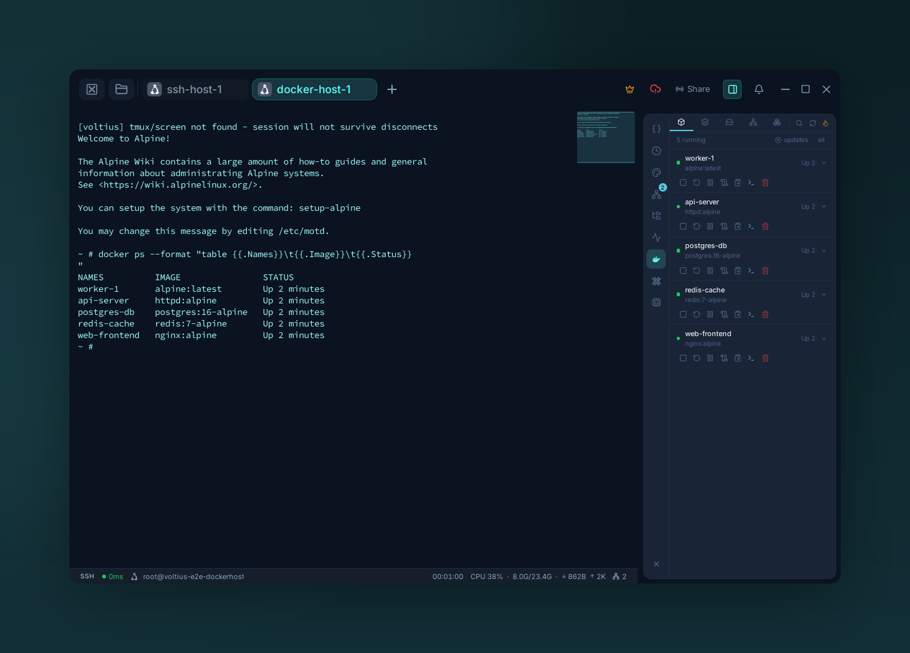

# Containers

{ .voltius-shot }
/// caption
The Docker panel — containers on the connected host over the existing SSH channel, with start/stop/logs/exec per row.
///

Manage Docker containers and Proxmox VE LXC containers from the right-side rail without leaving your terminal session.

## Where

Voltius exposes container management as plugin panels on any active session:

| Panel | Available when | Target |
| --- | --- | --- |
| **Docker** | Docker is available locally or on the connected SSH host | Docker daemon for the current session |
| **Proxmox LXC** | The active SSH connection is a Proxmox VE host | LXC containers on that Proxmox node |

Docker works for both local terminals and SSH sessions. Remote Docker access uses the existing SSH channel, so you do not need to expose the Docker socket or switch Docker contexts.

The Proxmox LXC panel appears for Proxmox VE connections and manages containers through the connected host.

## Docker

| Action | How |
| --- | --- |
| Exec a shell in a container | Select a container, then open an exec terminal |
| Start / stop / restart / pause | Use the row actions for the container |
| Tail logs | Open **Logs** for the container |
| Browse resources | Switch between **Containers**, **Images**, **Volumes**, **Networks**, and **Stacks** |
| Check image updates | Use the Images view update check |
| Update Compose stacks | Open **Stacks**, then run stack actions |

Exec terminals open as normal Voltius tabs, with the same split panes, broadcast, snippets, and terminal features as any other session.

!!! tip
    For remote hosts, no Docker context switching is needed — Voltius proxies Docker operations over the active SSH connection.

## Proxmox LXC

The **Proxmox LXC** panel is focused on LXC container lifecycle and snapshot workflows.

| Action | How |
| --- | --- |
| View LXC containers | Open the **Proxmox LXC** right-panel section |
| Start / stop / restart | Use the row actions for the LXC container |
| Open a shell | Click the terminal action on a running container |
| View snapshots | Click the snapshot action for a container |
| Create a snapshot | Enter a name, optionally add a description, then create |
| Roll back or delete snapshots | Use the actions in the snapshot list |

Shells opened from LXC containers are added as normal terminal tabs and are labeled with the container name.

!!! note
    Proxmox LXC management requires an SSH connection to a Proxmox VE host. If the active connection is not detected as Proxmox VE, the panel shows a "Proxmox VE not detected" state instead of listing containers.
