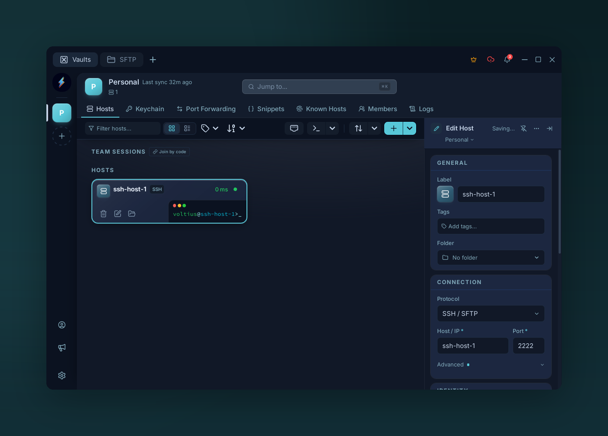

# Hosts

{ .voltius-shot }
/// caption
The Hosts page — toolbar, host list, and the detail panel for the selected host.
///

The default landing tab. One card per saved connection.

## Toolbar

- **Search** — fuzzy match on name, host, username, tags.
- **Add host** — opens the connection form (see [First connection](../getting-started/first-connection.md)).
- **View** — grid or list.
- **Filter** — by folder, vault, tag.

## Card actions

Hover for inline actions; right-click for the full context menu:

- **Connect** — open a terminal tab.
- **SFTP** — open the [file manager](sftp.md).
- **Edit** / **Duplicate** / **Delete**.
- **Pin** — sticky to the top of the list.
- **Move to vault** — re-key into a different vault.

!!! tip
    Double-click a card to connect. ++enter++ also connects from the keyboard.
