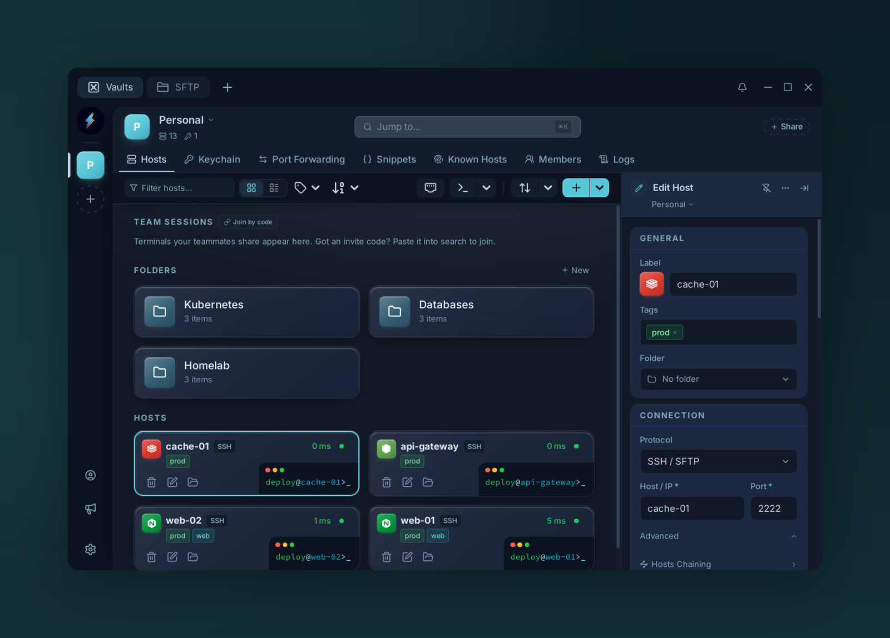

# Hosts

{ .voltius-shot }
/// caption
The Hosts page — toolbar, host list, and the detail panel for the selected host.
///

The default landing tab. One card per saved connection.

## Toolbar

- **Filter hosts** — case- and accent-insensitive match on name, host and username (++ctrl+f++ focuses it).
- **New Host** — opens the connection form (see [First connection](../getting-started/first-connection.md)); its arrow adds **New Serial Host** or **New Folder**.
- **View** — grid or list.
- **Tags** — filter by one or more tags.
- **Sort** — by name or creation date.

## Card actions

Each card has inline **Delete**, **Edit** and **Open in SFTP** buttons, and its terminal preview connects; right-click for the full context menu:

- **Connect** — open a terminal tab.
- **Open in SFTP** — open the [file manager](sftp.md).
- **Edit** / **Duplicate** / **Delete**.
- **Pin** — sticky to the top of the list.
- **Move to** / **Copy to** — move or copy the host into another vault.

!!! tip
    Double-click a card to connect. ++enter++ also connects from the keyboard.
