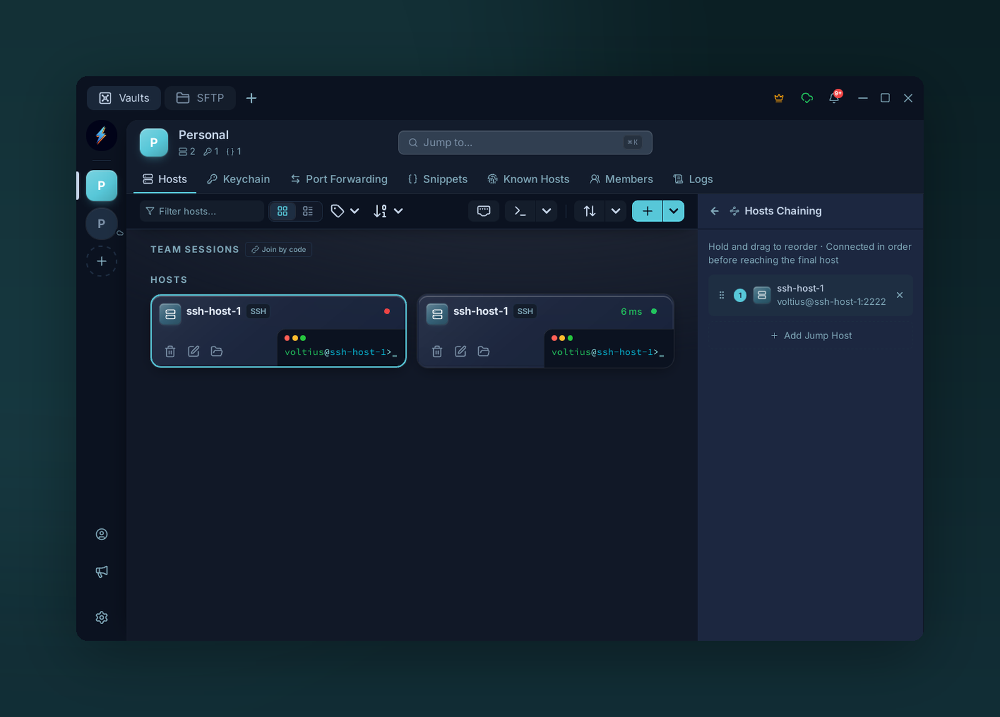

# Jump hosts

{ .voltius-shot }
/// caption
Chain jump hosts (bastions) — Voltius connects through each hop before the final host.
///

Chain SSH through one or more bastions. Equivalent to OpenSSH's `ProxyJump` (`-J`).

## Add a hop

Connection form → **Jump hosts** → **+ Add hop**.

Each hop reuses a saved host from any vault. Reorder with the drag handle.

## How it works

```text
You → Bastion A → Bastion B → Target
       (saved)    (saved)     (saved)
```

Each leg is a `direct-tcpip` channel through the previous one — no public ports needed on intermediates.

!!! warning "Identity scope"
    Each hop authenticates with its own credentials. The target host does **not** see the bastion's key.
