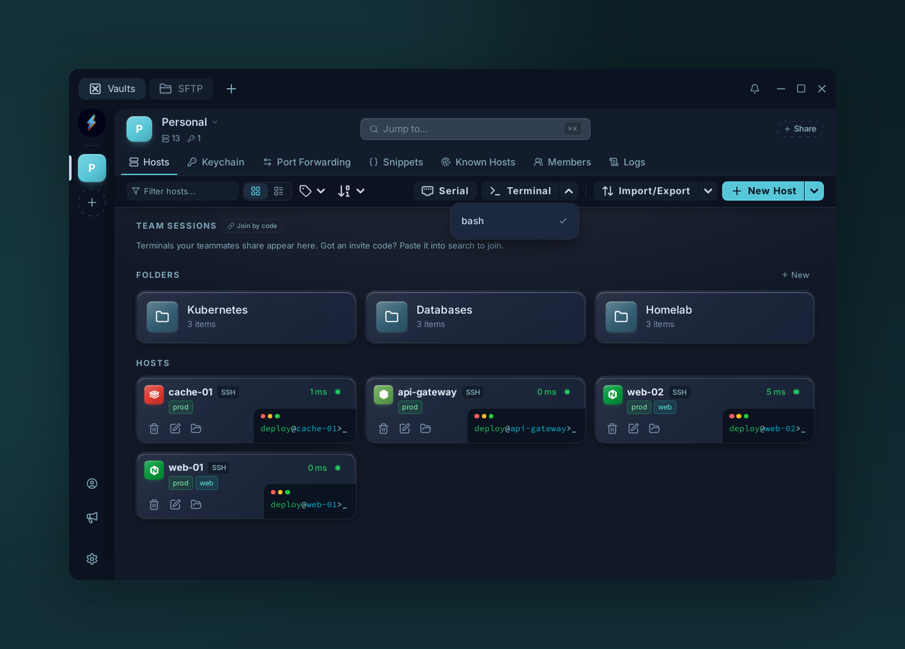

# Local terminal

{ .voltius-shot }
/// caption
Open a local terminal in any installed shell — no host required.
///

Open a local shell — no SSH involved.

## Supported shells

=== "Windows"

    - PowerShell (Core + Windows PowerShell)
    - Command Prompt (`cmd.exe`)
    - Git Bash
    - WSL (default distro)
    - Cygwin, Cmder (when installed)

=== "macOS / Linux"

    - Your login shell (`$SHELL`)
    - Zsh, Bash and Fish, when installed

## Opening one

- **Hosts page → Terminal** button (its arrow picks the shell), or the **Local** section of the new-tab **+** menu.
- Command palette → type the shell name.

Local terminals support split panes, broadcast, themes — same as SSH sessions.

!!! tip "Pick a default shell"
    The shell you choose in the **Terminal** dropdown becomes the default for new local terminals.
