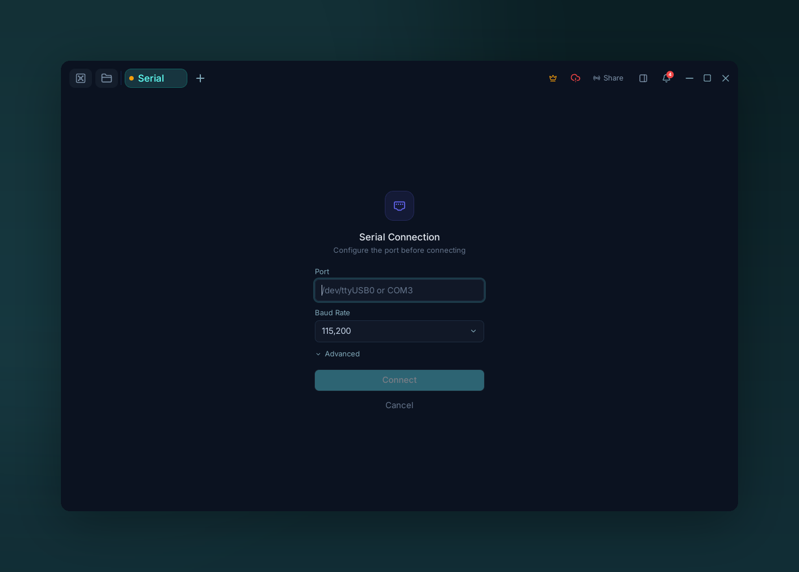

# Serial

{ .voltius-shot }
/// caption
Connect to a serial device — pick the port and baud rate.
///

For physical devices: routers, microcontrollers, embedded boards.

## Pick a port

The **Port** dropdown lists detected serial devices:

- **Windows** — `COM1`, `COM2`, …
- **macOS / Linux** — `/dev/tty.usbserial-*`, `/dev/ttyUSB0`, …

Click **Refresh** if you plug in a device after opening the form.

## Settings

| Field | Default | Options |
| --- | --- | --- |
| Baud | `115200` | 9600 / 19200 / 38400 / 57600 / 115200 / 230400 / 460800 / 921600 / custom |
| Data bits | `8` | 5, 6, 7, 8 |
| Parity | `none` | none, odd, even |
| Stop bits | `1` | 1, 2 |
| Flow control | `none` | none, software, hardware |

Defaults match 8-N-1 — try those first.

## Advanced

- **Pre/post command** — sent to the port before/after the session.
- **Terminal encoding** — non-UTF-8 firmware.

!!! tip "Permission denied on Linux?"
    `sudo usermod -aG dialout $USER` and log out/in.
