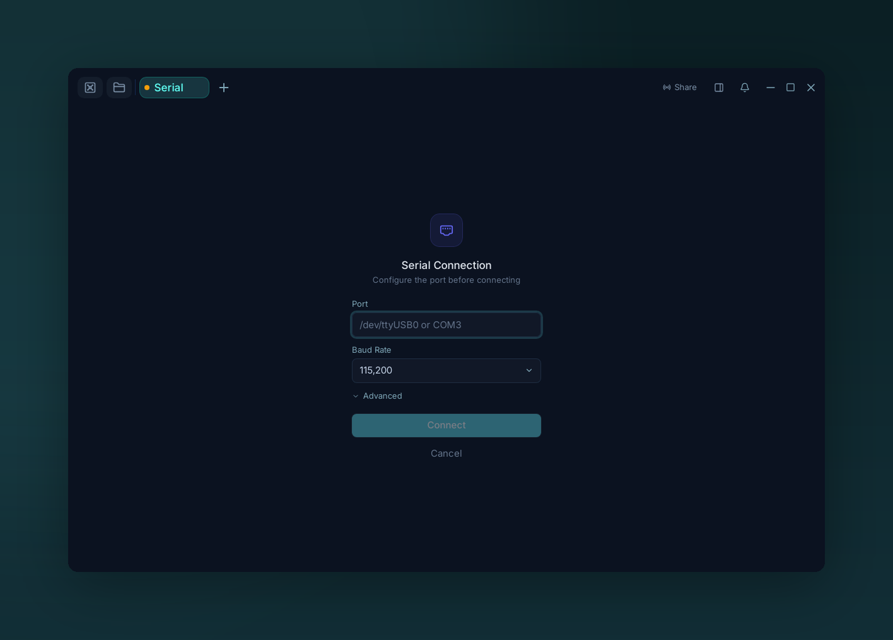

# Serial

{ .voltius-shot }
/// caption
Connect to a serial device — pick the port and baud rate.
///

For physical devices: routers, microcontrollers, embedded boards.

## Pick a port

The **Port** field suggests detected serial devices as you type — or enter a path directly:

- **Windows** — `COM1`, `COM2`, …
- **macOS / Linux** — `/dev/tty.usbserial-*`, `/dev/ttyUSB0`, …

If you plug in a device after opening the form, close and reopen it to see the new port.

## Settings

| Field | Default | Options |
| --- | --- | --- |
| Baud | `115200` | presets from 300 to 921600, or custom (saved hosts) |
| Data bits | `8` | 5, 6, 7, 8 |
| Parity | `none` | none, odd, even |
| Stop bits | `1` | 1, 2 |
| Flow control | `None` | None, XON/XOFF, RTS/CTS |

Defaults match 8-N-1 — try those first.

## Advanced

- **Pre/post command** — sent to the port before/after the session.
- **Terminal encoding** — non-UTF-8 firmware.
- **Auto-reconnect** — reopen the port after a drop (on by default; turn it off for boards you reflash).

DTR, RTS and **BRK** controls are in the session's status bar.

!!! tip "Permission denied on Linux?"
    `sudo usermod -aG dialout $USER` and log out/in.
