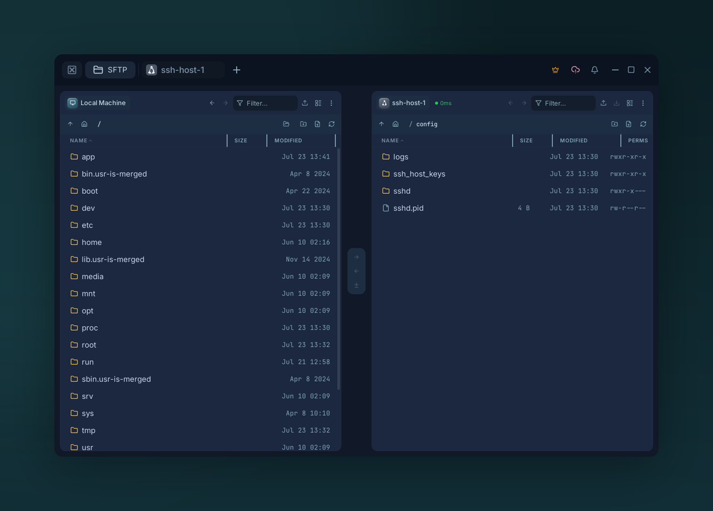
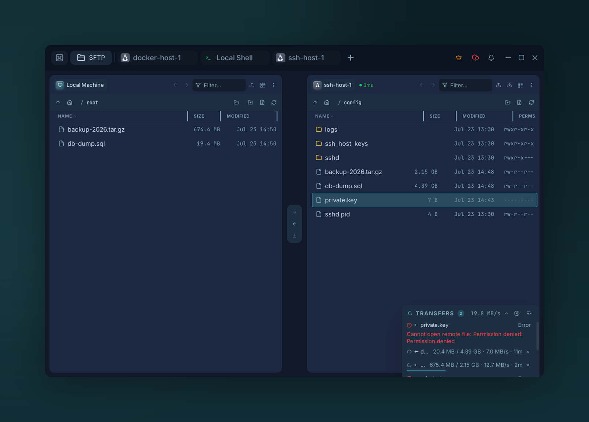

# SFTP

{ .voltius-shot }
/// caption
Two-pane SFTP — drag files between local and remote, or host to host.
///

Two-pane file manager over SSH. Any pane can be **local** or a **remote host** — drag files between them.

## Opening it

- From a host card → **SFTP** action.
- From a live session → **SFTP** button on the terminal tab.
- Multiple SFTP tabs can be open at once.

## Panes

Each pane is independent — click the pane header to swap targets without closing the tab.

## Drag & drop

| From → To | Action |
| --- | --- |
| Local → Remote | Upload |
| Remote → Local | Download |
| Local → Local | Copy (direct filesystem copy) |
| Remote A → Remote B | Host-to-host (streamed via Voltius, never your disk) |
| OS file manager → Voltius | Upload |
| Voltius → OS file manager | Download |

## Tar acceleration

Directory and multi-file transfers are slow over plain SFTP — every file is its own open, write, and close round trip. With **SFTP Tar Acceleration** on (the default), Voltius packs a directory or batch selection into a single temporary `.tar.gz`, transfers that, and extracts it on the other side. One stream instead of thousands of round trips, applied to uploads, downloads, and host-to-host transfers alike. Single files always use the direct path.

!!! note "Automatic fallback"
    Tar acceleration needs `tar` on each host it touches. Voltius checks first, so any transfer involving a host without `tar` quietly falls back to plain recursive SFTP — nothing fails, it just runs the per-file way.

Turn it off (in settings, **SFTP Tar Acceleration**) if a host has tight temporary space or you want predictable per-file behavior. For the engineering details, see [How Voltius Speeds Up SFTP with Tar Acceleration](https://voltius.app/blog/sftp-tar-acceleration).

## Transfer queue

{ .voltius-shot }
/// caption
The transfer queue — live progress, speed, and ETA per item, with a failed transfer showing its error. Pause, resume, retry, or cancel.
///

Pause, resume, retry, cancel. Conflicts open a dialog with **Overwrite / Skip / Rename / Apply to all**.

!!! tip "Edit in place"
    Right-click a remote file → **Open in editor**. Voltius downloads it, watches for changes, and re-uploads on save.
