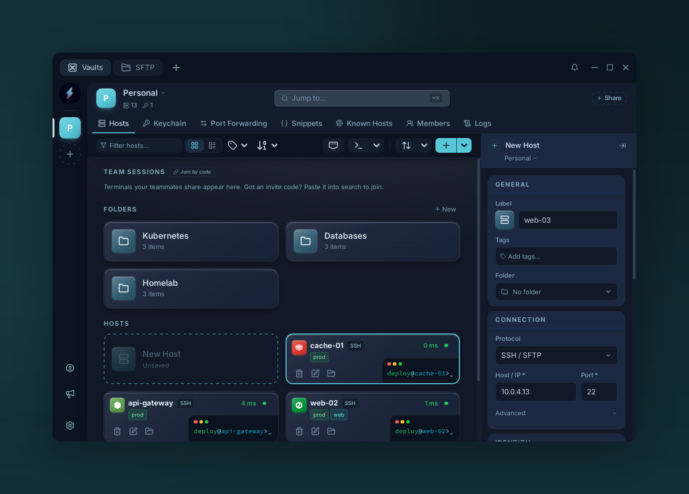

# SSH

{ .voltius-shot }
/// caption
Creating an SSH connection — label, protocol, host and port.
///

Voltius speaks SSH via [russh](https://github.com/Eugeny/russh) — pure-Rust, no OpenSSH binary required.

## Required

| Field | Default |
| --- | --- |
| **Host** | hostname or IP |
| **Port** | `22` |
| **Username** | `root` |
| **Password** / **Private Key** | either one (a key from the Keychain, or pasted) — or pick a **Keychain Identity** |

## Optional

- **Identity** — share an SSH key across many hosts. See [Identities](../keychain/identities.md).
- **Folder / Tags** — organize. See [Folders & tags](../organization/folders-tags.md).
- **Hosts Chaining** (under **Advanced**) — chain through bastions. See [Jump hosts](jump-hosts.md).
- **Env vars** — exported into the remote shell.
- **Agent forwarding** — toggle to forward your SSH agent.
- **Pre / Post Command** — a command (or snippet) typed into the remote shell right after connecting / just before disconnecting.
- **Legacy Algorithms** — allow weak ciphers and key exchanges for old devices.
- **Shell Integration / Keepalive / Persistent session / Proxy** — per-host overrides of the global settings.
- **Terminal encoding** — override if remote isn't UTF-8.
- **Distro / icon** — cosmetic; auto-detect after first connect.

To stop the background TCP probe behind a host's status dot, use **Disable reachability check** in its right-click menu.

## What gets stored

| Where | What |
| --- | --- |
| Vault (encrypted) | Password, private key |
| Vault metadata | Everything else |
| Outside vault | Nothing |

See [Security](../security/index.md).
