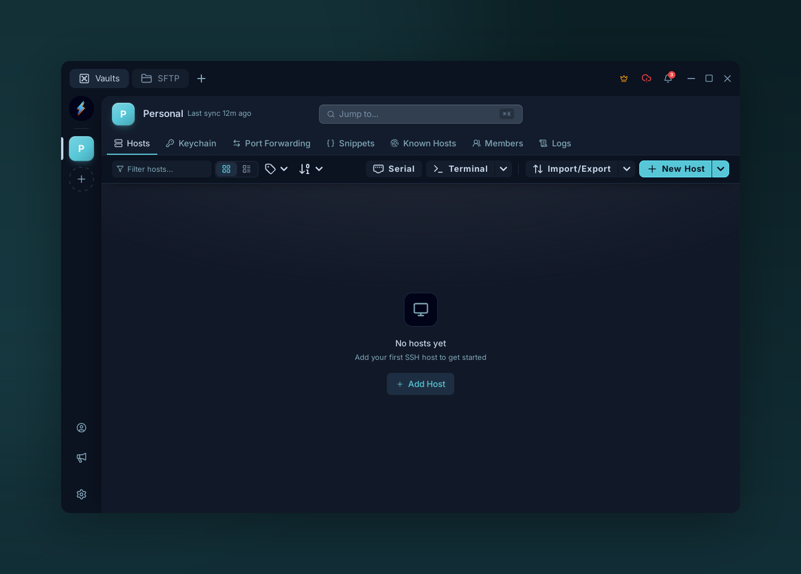
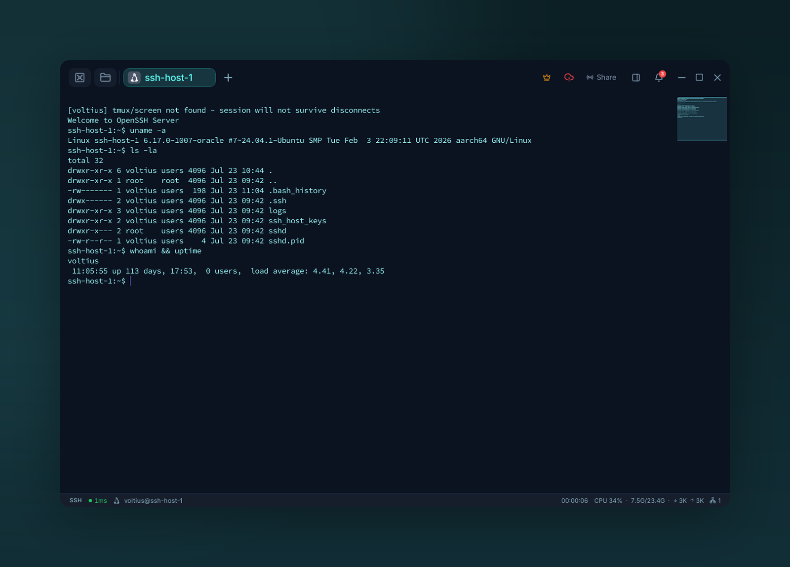

# First connection

{ .voltius-shot }
/// caption
The Hosts page — click Add Host to create your first connection.
///

## 1. Add a host

On the **Hosts** tab, click **Add host**. Fill in:

| Field | Default |
| --- | --- |
| **Host** | hostname or IP |
| **Port** | `22` |
| **Username** | `root` |
| **Auth type** | Password or Key |

## 2. Auth

=== "Password"
    Type it in. Stored locally in your XChaCha20-Poly1305 vault — never sent to a server.

=== "SSH key"
    Pick an **Identity** (username plus reusable password or key credentials) from the dropdown, or click **+ New**. See [Identities](../keychain/identities.md).

## 3. Connect

Click **Save**, then click the host card. First-time hosts prompt for fingerprint approval — see [Known hosts](../keychain/known-hosts.md).

{ .voltius-shot }
/// caption
Your first terminal session, connected over SSH.
///

## Next

- [Folders & tags](../organization/folders-tags.md) — before the list gets long.
- [Identities](../keychain/identities.md) — reuse one key across hosts.
- ++ctrl+k++ / ++cmd+k++ — connect from the [command palette](../terminal/command-palette.md).
