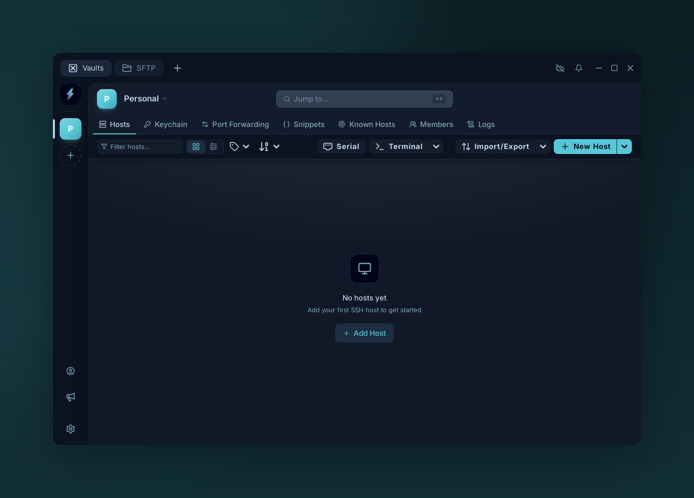
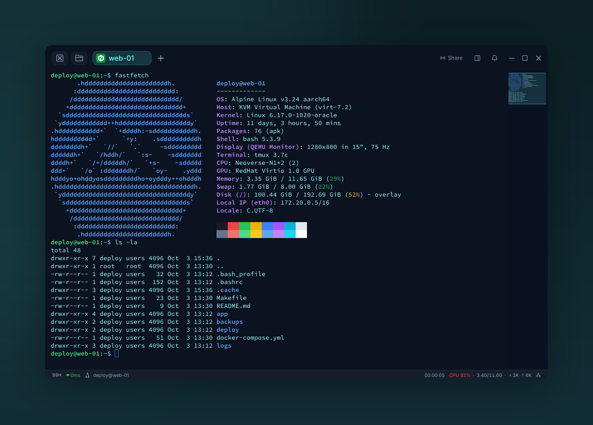

# First connection

{ .voltius-shot }
/// caption
The Hosts page — click Add Host to create your first connection.
///

## 1. Add a host

On the **Hosts** tab, click **New Host** (or **Add Host** while the list is empty). Fill in:

| Field | Default |
| --- | --- |
| **Host / IP** | hostname or IP |
| **Port** | `22` |
| **Username** | `root` |
| **Password** / **Private Key** | empty — fill in one, or pick a **Keychain Identity** |

## 2. Auth

=== "Password"
    Type it in. Stored locally in your XChaCha20-Poly1305 vault — never sent anywhere in plaintext; if you turn on sync, it travels end-to-end encrypted.

=== "SSH key"
    Pick an **Identity** (username plus reusable password or key credentials) under **Keychain Identity**, or leave it on *No identity* and choose a saved key — or paste one — under **Private Key**. To make a new identity, use **Manage in Keychain**. See [Identities](../keychain/identities.md).

## 3. Connect

The host saves as you type — there is no Save button. Double-click the host card (or click its terminal preview) to connect. Voltius trusts and pins a host's key the first time it sees it, and only asks you if that key later changes — see [Known hosts](../keychain/known-hosts.md).

{ .voltius-shot }
/// caption
Your first terminal session, connected over SSH.
///

## Next

- [Folders & tags](../organization/folders-tags.md) — before the list gets long.
- [Identities](../keychain/identities.md) — reuse one key across hosts.
- ++ctrl+k++ / ++cmd+k++ — connect from the [command palette](../terminal/command-palette.md).
