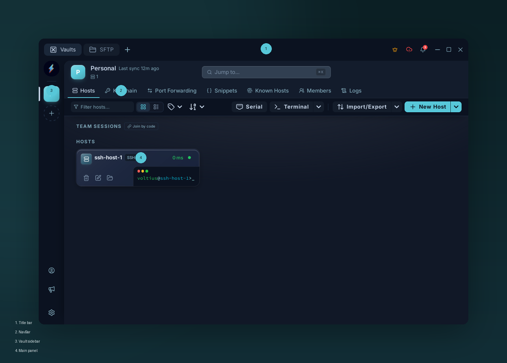

# Tour

{ .voltius-shot }
/// caption
The four regions of the window: title bar, NavBar, vault sidebar, and main panel.
///

Four regions:

**Title bar** — custom (system one is hidden). Holds the omnibar in the middle. Drag anywhere blank to move the window.

**Top NavBar** — feature tabs:

| Tab | What |
| --- | --- |
| Hosts | Browse and connect |
| Keychain | SSH keys + identities |
| Port Forwarding | SSH tunnels |
| Snippets | Reusable commands |
| Known Hosts | Pinned fingerprints |
| Members | (Teams) team members |
| Logs | (Teams) audit log |

**Vault sidebar** — encrypted stores. **Personal** by default; Teams adds shared vaults. Click a vault to scope the main panel.

**Main panel** — list + toolbar + side panel that slides in when you select an item.

## Terminal tabs

Open a session and a tab strip appears along the top. Tabs **split** horizontally or vertically and can **broadcast** keystrokes — see [Split panes](../terminal/panes.md).

## Command palette

++ctrl+k++ / ++cmd+k++ from anywhere. Connect by host name, run snippets, jump to settings. See [Command palette](../terminal/command-palette.md).

## Settings

Bottom of the vault sidebar → account button → **Settings**.
