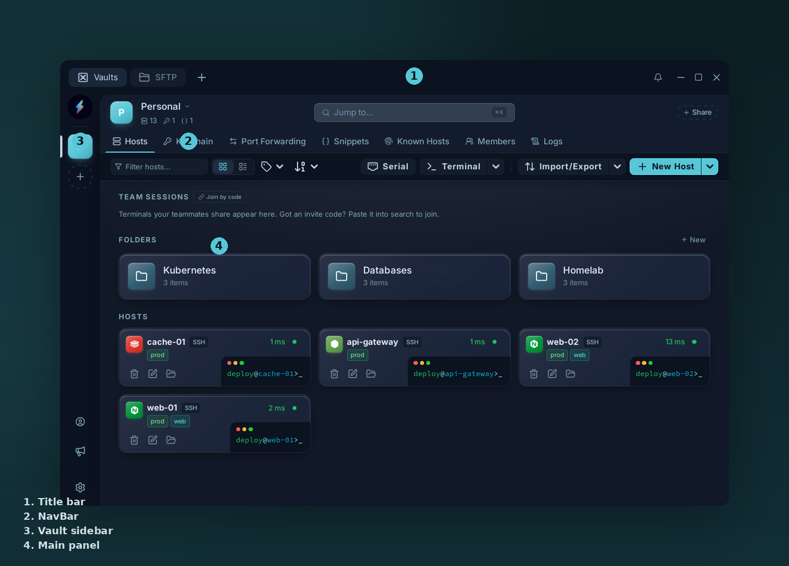

# Tour

{ .voltius-shot }
/// caption
The four regions of the window: title bar, NavBar, vault sidebar, and main panel.
///

Four regions:

**Title bar** — custom (system one is hidden). Holds **Vaults** and **SFTP**, your session tabs and the **+** new-session button, with notifications and window controls on the right. Drag anywhere blank to move the window. The **Jump to...** bar (the omnibar) sits just below it, in the middle of the vault header.

**Top NavBar** — feature tabs:

| Tab | What |
| --- | --- |
| Hosts | Browse and connect |
| Keychain | SSH keys + identities |
| Port Forwarding | SSH tunnels |
| Snippets | Reusable commands |
| Known Hosts | Pinned fingerprints |
| Members | (Teams) team members |
| Logs | Activity log for the vault (team-wide audit log on team vaults) |

**Vault sidebar** — encrypted stores. **Personal** by default; Teams adds shared vaults. Click a vault to scope the main panel.

**Main panel** — list + toolbar + side panel that slides in when you add or edit an item.

## Terminal tabs

Open a session and it gets a tab in the title bar, next to **Vaults** and **SFTP**. Tabs **split** horizontally or vertically and can **broadcast** keystrokes — see [Split panes](../terminal/panes.md).

## Command palette

++ctrl+k++ / ++cmd+k++ from anywhere. Connect by host name, run snippets, jump to settings. See [Command palette](../terminal/command-palette.md).

## Settings

Click the gear (**Settings**) at the bottom of the vault sidebar.
