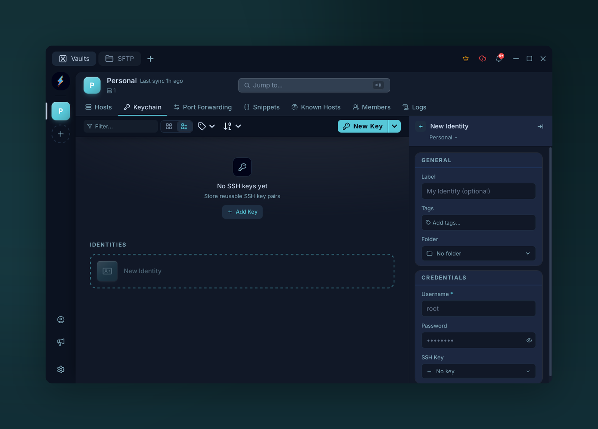

# Identities

{ .voltius-shot }
/// caption
An identity bundles a username with a password or SSH key — reuse it across many hosts.
///

An **identity** = a username plus reusable credentials. It can use a password, an SSH key, or an inline key. Bind many hosts to one identity, and credential rotation is one edit.

## Create one

**Keychain → Identities → +**, or **+ New** from the identity picker in a connection form.

| Field | Notes |
| --- | --- |
| **Name** | Display label (e.g. `ops-ed25519`) |
| **Username** | Usually `root`, `admin`, `ec2-user`, your handle… |
| **Password** | Optional password for password-based SSH auth |
| **Key** | Optional [SSH key](ssh-keys.md); leave unset for password auth |

## Using one

In a connection, pick an **Identity**. Voltius fills in the username and uses the identity's key if one is selected; otherwise it uses the identity password when present. Override per-connection by typing in the Username field.

!!! tip
    Identities scope to a vault. A team vault's identity is shared with everyone who can decrypt that vault.
