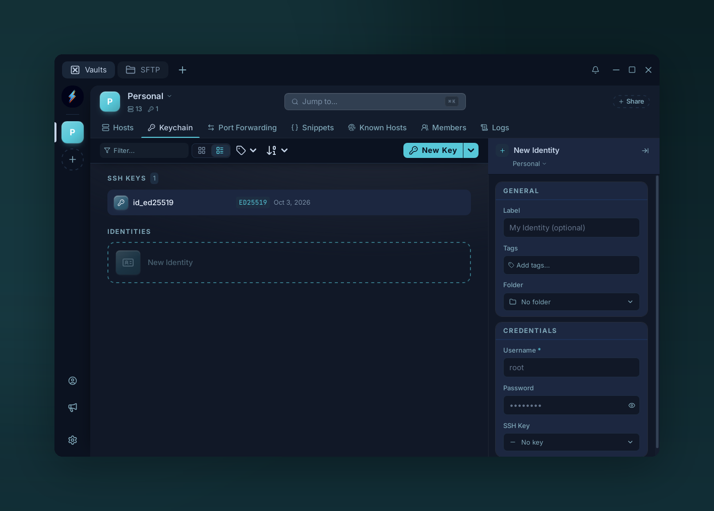

# Identities

{ .voltius-shot }
/// caption
An identity bundles a username with a password or SSH key — reuse it across many hosts.
///

An **identity** = a username plus reusable credentials. It can use a password, an SSH key, or an inline key. Bind many hosts to one identity, and credential rotation is one edit.

## Create one

**Keychain → New Key ▾ → New Identity** (or **Add Identity** when the list is empty). The identity picker in a connection form links there via **Manage in Keychain**.

| Field | Notes |
| --- | --- |
| **Label** | Optional display label (e.g. `ops-ed25519`); defaults to the username |
| **Username** | Usually `root`, `admin`, `ec2-user`, your handle… |
| **Password** | Optional password for password-based SSH auth |
| **SSH Key** | Optional [SSH key](ssh-keys.md), or **New key (inline)...** to paste one; leave at **No key** for password auth |

## Using one

In a connection, pick a **Keychain Identity**. Voltius fills in the username and uses the identity's key if one is selected, falling back to the identity password if the key is rejected or absent. To use a different username for one host, set **Keychain Identity** to **No identity — inline credentials** and enter it there.

!!! tip
    Identities scope to a vault. A team vault's identity is shared with everyone who can decrypt that vault.
