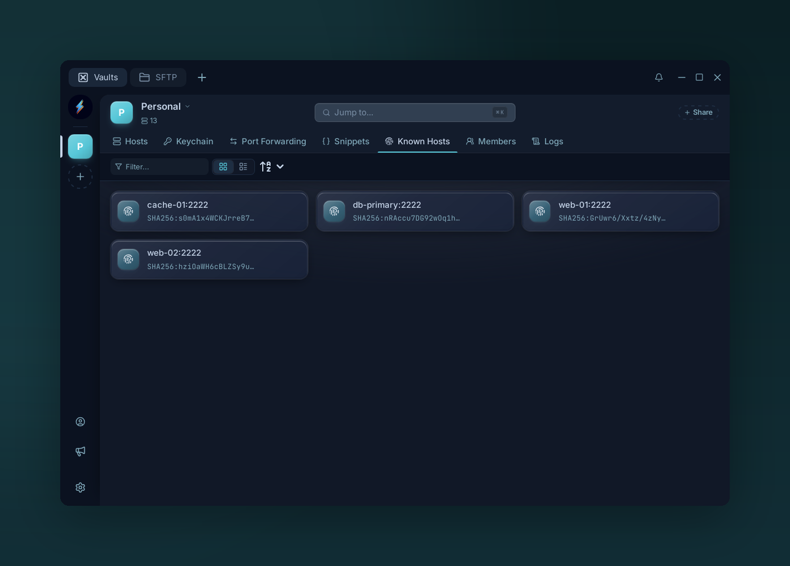

# Known hosts

{ .voltius-shot }
/// caption
Known Hosts — pinned SSH fingerprints, verified on every connection.
///

The list of remote host fingerprints Voltius has pinned. Equivalent to OpenSSH's `~/.ssh/known_hosts`.

## How entries arrive

The first time you connect to a host, Voltius trusts its fingerprint and pins it here automatically (trust on first use). Later connections must present the same key.

## What to do here

| Action | Why |
| --- | --- |
| **Delete** | Forget the pin; the next connection trusts and pins the key it sees |
| **Filter** | Find by host |

## Mismatch warning

If a connect attempt produces a fingerprint that doesn't match the pinned one, Voltius blocks the connection and shows a comparison. Treat this as **suspicious** — possible MITM. Resolve out-of-band before accepting. The panel offers **Replace** (the right choice after a legitimate server key change: rebuild, key rotation), **Add as new**, which keeps the old key trusted too, and **Abort**.

!!! tip
    Known-hosts pins are kept per device and are not shared through team vaults. Each teammate pins a host's key on their own first connection.
