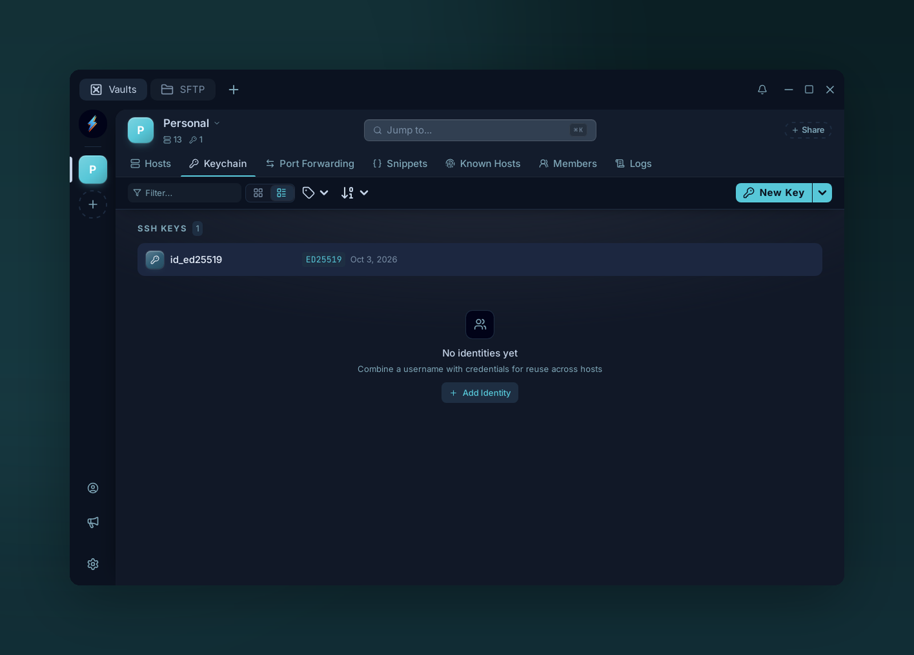

# SSH keys

{ .voltius-shot }
/// caption
Keychain — reusable SSH key pairs, stored encrypted and attachable to any host.
///

## Add a key

**Keychain → New Key** (or **Add Key** when the list is empty). Two modes:

=== "Generate"

    Pick a type and Voltius generates the pair:

    - **Ed25519** (recommended) — modern, short, fast.
    - **RSA** (2048 or 4096 bits, default 4096) — broadest compatibility.
    - **ECDSA P-256** / **P-384** / **P-521**.

    The public key is shown after generation — copy it to `~/.ssh/authorized_keys` on your server.

=== "Import"

    Paste the private key (OpenSSH, PEM, or PuTTY `.ppk`), or drop or pick a key file under **Import from File**. For an encrypted key, fill the optional **Passphrase** field to save it with the key; otherwise Voltius asks for it when you connect.

## Export

Right-click a key → **Add to host** to append its public key to `~/.ssh/authorized_keys` on a saved host.

To back keys up, select them and choose **Export N public keys**, or run **Export SSH keys…** from the command palette. The export is a JSON bundle that includes the private keys, so **Encrypt backup** is on by default and asks for a password.

!!! warning
    If you turn **Encrypt backup** off, the export holds your private keys in plain text. Keep encryption on, or rely on vault sync as your backup.
