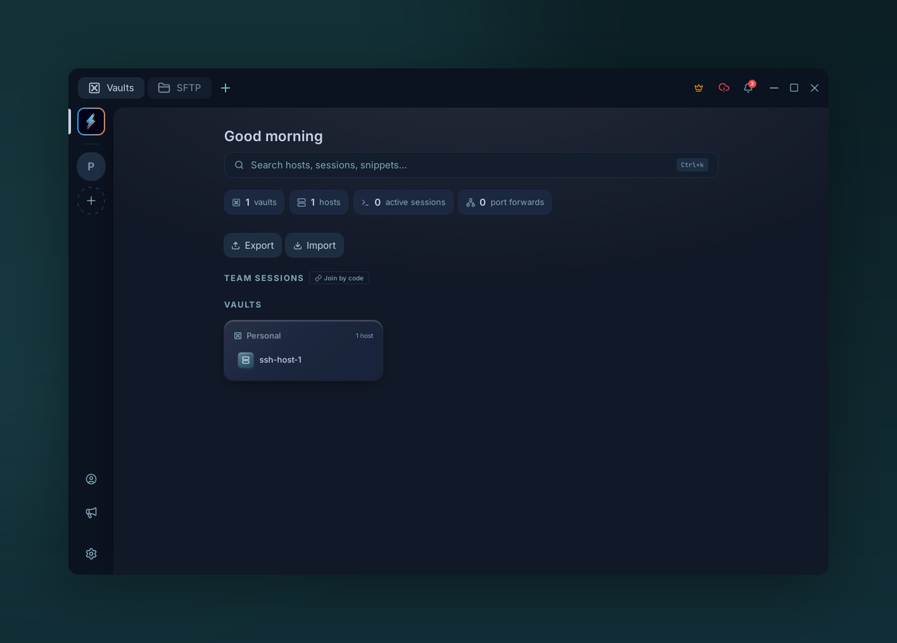

# Dashboard

{ .voltius-shot }
/// caption
The dashboard — search, quick stats, and your vaults at a glance.
///

The view that opens when no host is selected.

## Sections

- **Hero** — quick actions: new host, local terminal, open SFTP.
- **Recent hosts** — last few connections, ordered by use.
- **Vaults overview** — count of hosts / keys / identities / snippets per vault.
- **All hosts** — the full grid, scrollable.

## Why use it

Most-recent ordering means a daily set of 5–6 hosts surfaces without scrolling. For everything else, search (++ctrl+k++) is faster.
