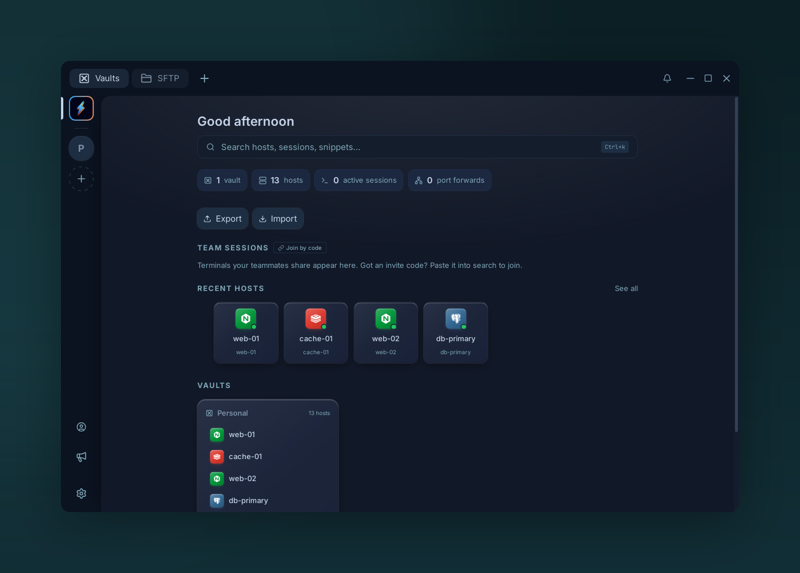

# Dashboard

{ .voltius-shot }
/// caption
The dashboard — search, quick stats, and your vaults at a glance.
///

The view Voltius opens on launch. Click the Voltius logo at the top of the vault rail to come back to it.

## Sections

- **Hero** — greeting, a search bar (opens the command palette) and counts of vaults, hosts, active sessions and port forwards. **Export** / **Import** buttons sit below it.
- **Team sessions** — terminals your teammates share, with **Join by code**.
- **Recent hosts** — pinned hosts first, then your most recently used ones, six at a time.
- **Vaults** — one card per vault with its host count and its top six hosts; click one to connect.
- **All hosts** — **See all** next to Recent hosts opens a grid of every host, pinned first.

## Why use it

Most-recent ordering means a daily set of 5–6 hosts surfaces without scrolling. For everything else, search (++ctrl+k++) is faster.
