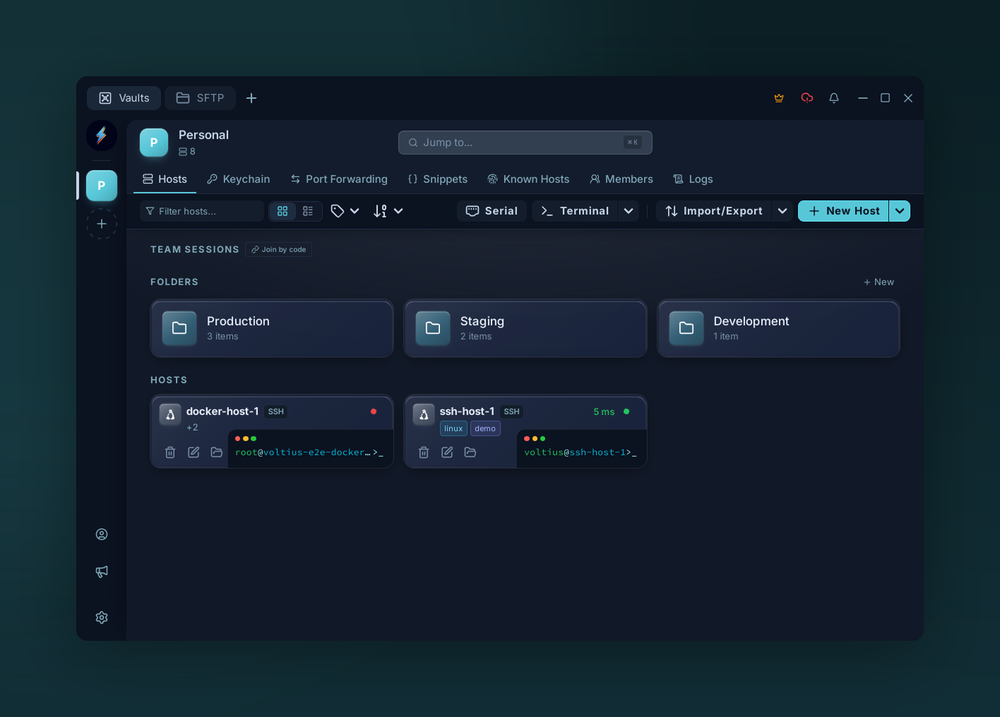

# Folders & tags

{ .voltius-shot }
/// caption
Group hosts into folders and label them with tags. Folders keep large host lists tidy; tags cut across folders so you can filter by role — web, db, staging — from anywhere.
///

Two ways to organize. Use both.

## Folders

Exclusive — a host belongs to **one** folder. Best for stable groupings: `Prod`, `Staging`, `Dev`.

- Create from the **Hosts toolbar → New folder**.
- Drag a host onto a folder to move it.
- Folders can nest one level.

## Tags

Multi-value labels. Best for cross-cutting axes: `db`, `eu-west`, `customer-x`.

- Add tags from the connection form (free text, auto-complete from existing tags).
- Filter the Hosts list by clicking a tag chip.

!!! tip
    Folder for **where it lives**, tag for **what it is**. A host can be in folder `Prod` and tagged `db`, `postgres`, `eu-west`.
