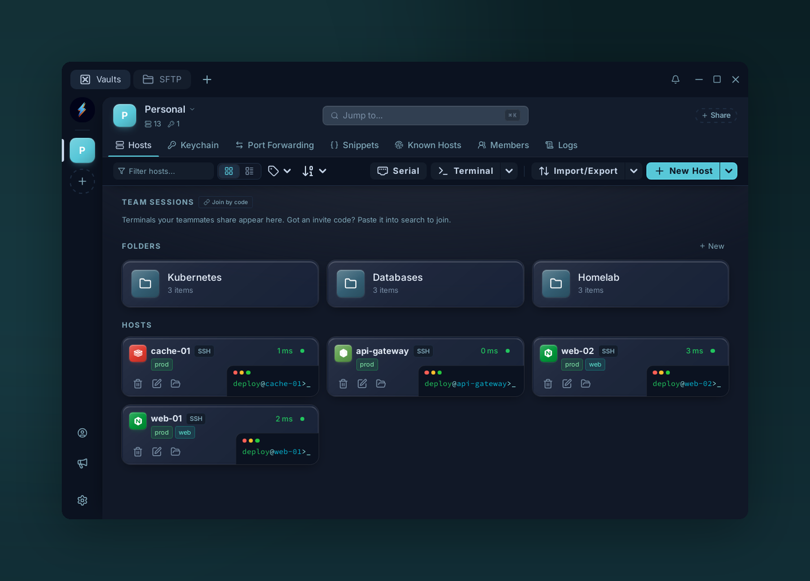

# Folders & tags

{ .voltius-shot }
/// caption
Group hosts into folders and label them with tags. Folders keep large host lists tidy; tags label hosts by role — web, db, staging — and filter the list you're looking at.
///

Two ways to organize. Use both.

## Folders

Exclusive — a host belongs to **one** folder. Best for stable groupings: `Prod`, `Staging`, `Dev`.

- Create one from the arrow beside **New Host** → **New Folder**, from **+ New** next to the Folders heading, or by right-clicking an empty spot in the list.
- Drag a host onto a folder to move it.
- Folders nest to any depth: create one while inside another, or set **Parent folder** in its edit panel.

## Tags

Multi-value labels. Best for cross-cutting axes: `db`, `eu-west`, `customer-x`.

- Add tags from the connection form (free text, auto-complete from existing tags).
- Filter the Hosts list with the tag button in the toolbar (*Filter by tag*). Pick several tags to show hosts carrying any of them. The same menu renames or deletes a tag.

!!! tip
    Folder for **where it lives**, tag for **what it is**. A host can be in folder `Prod` and tagged `db`, `postgres`, `eu-west`.
