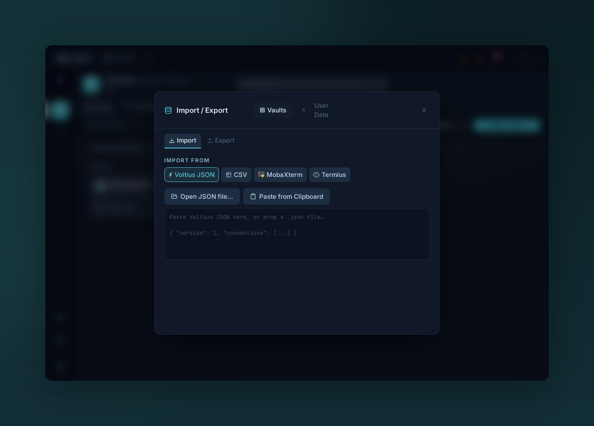

# Import / Export

{ .voltius-shot }
/// caption
Import from Voltius JSON, CSV, MobaXterm, or Termius — or export your vault.
///

**Settings → Import/Export.** JSON only, today. More formats are on the roadmap.

## Export

Pick a vault, click **Export**. A JSON file downloads with:

- Hosts (metadata)
- Folders, tags
- Snippets
- Identities

Secrets (passwords, private keys) are exported in cleartext inside the JSON — treat it like a credential file.

## Import

Paste JSON or pick a file. Voltius dry-runs the import and shows you what'll be added vs. updated before committing.

!!! warning "Other clients"
    Direct import from Termius / OpenSSH config / PuTTY isn't built in yet. For now: write a [plugin](../plugins/developing.md) — the API surface for `connections.bulkImport` is designed for this. An example SSH-config importer ships in the marketplace docs.
