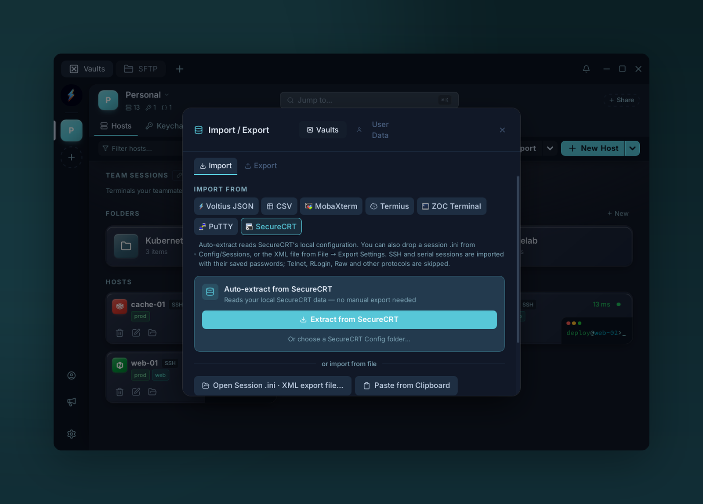

# Import / Export

{ .voltius-shot }
/// caption
Import from Voltius JSON, CSV, MobaXterm, Termius, ZOC Terminal, PuTTY or SecureCRT — or export your vault.
///

Open it from the **Import/Export** button in the Hosts toolbar (its menu lists every source), from the dashboard quick actions, or from the command palette (++ctrl+k++, then *Import from…*).

## Import

### Sources

| Source | How | What comes over |
| --- | --- | --- |
| **Voltius JSON** | Open a `.json` file or paste it. Encrypted backups ask for their password. | Everything in the export. |
| **CSV** | Open a file or paste. Columns: `name,host,port,username,auth_type,tags`. | Connections. |
| **MobaXterm** | **Auto-extract** reads the local install (Windows), or drop `MobaXterm.ini`. | SSH sessions (folders become tags), saved passwords and credentials. |
| **Termius** | **Auto-extract** reads the local install. Termius must be installed and logged in. | Hosts, groups, identities, keys, snippets and port forwarding rules. |
| **PuTTY / KiTTY** | **Auto-extract** reads saved sessions from the registry on Windows, or from `~/.putty/sessions` on Linux and macOS. Or drop a `.reg` export, or paste session files. | SSH and serial sessions, proxies, tunnels, KiTTY folders. Key files are not imported — add `.ppk` keys in the [Keychain](../keychain/ssh-keys.md). |
| **SecureCRT** | **Auto-extract** reads the local configuration, or pick a `Config` folder. Or drop a session `.ini` from `Config/Sessions`, or the XML from *File → Export Settings*. | SSH and serial sessions, folders, jump hosts, the private keys they use, and saved passwords. If the configuration has a config passphrase, Voltius asks for it — or you can import without passwords. Telnet, RLogin and Raw sessions are skipped. |
| **ZOC Terminal** | **Auto-extract** reads the Host Directory of the newest local ZOC install. Or drop `HostDirectory.zhd` — in `Documents\ZOC9 Files\Options` (Windows) or `~/Library/Application Support/ZOC9 Files/Options` (macOS). | SSH and serial entries, folders. Saved passwords are not imported. |

When you have more than one writable vault, **Import into** on the same screen picks one or more of them; the same items go into each.

!!! tip "OpenSSH config"
    `~/.ssh/config` isn't a one-shot import: the built-in **SSH Config Sync** plugin (on by default on desktop) keeps its hosts in sync as the file changes. Manage it from the [Plugins](../plugins/managing.md) page.

### Review

Nothing is written until you confirm. The review step lists every item grouped by type (connections, SSH keys, identities, snippets, port forwarding):

- **Duplicates** of items already in the target vault are flagged and set to **Skip**. Switch any of them to **Import** (keep both) or **Overwrite**, or use *Skip all duplicates* / *Re-include duplicates*.
- **Linked credentials** — an identity or key the import references but doesn't carry is relinked to the matching one already in the vault, or flagged so you can assign it afterwards.
- **Advanced → Tag** — tag every imported item, so a migration is easy to find later.

## Export

Pick one or more vaults (when you have several) and what to include — connections, identities, SSH keys, snippets, port forwarding rules. You can also export a selection or a folder from the Hosts, Keychain, Snippets and Port Forwarding pages.

- **Format** — **JSON** carries everything, including key content. **CSV** is connections only, for spreadsheets.
- **Include linked credentials** — adds the identities and keys the exported connections use. Leave it off to export connection settings only; on import they relink to a matching identity or key in that vault.
- Items the export depends on (jump hosts, snippets a host runs) are added automatically so the result keeps working.
- **Encrypt backup** (JSON only) — turns on by itself as soon as the export holds passwords, keys or host notes; the file is then only readable with the password you set here. Turning it off writes those secrets in cleartext — treat that file like a credential.

Download the file or copy it to the clipboard; *Show preview* displays the JSON first.

## User data

The **User Data** tab exports and imports device settings rather than vault contents: themes, UI preferences, shortcuts, app settings, recent people and the vault list. On import, Voltius lists the sections the file holds and applies only the ones you tick.
