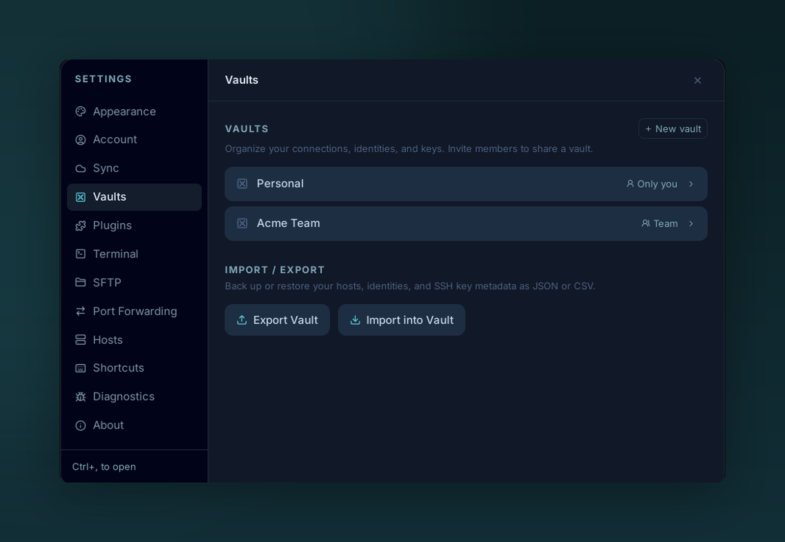

# Vaults

{ .voltius-shot }
/// caption
Vaults keep contexts separate. Your Personal vault is private to you; a Team vault is shared with — and end-to-end encrypted for — everyone you invite.
///

A **vault** is one encrypted store. Each vault has its own key — moving a host between vaults re-encrypts its secrets.

## Default vaults

- **Personal** — everyone has one. Local-only by default; syncs if you enable [Cloud sync](../sync/cloud-sync.md) or [Gist sync](../sync/gist-sync.md).
- **Team / Business** — created from the [Teams](../teams/index.md) settings. Shared with other members; access is server-enforced.

## What's in a vault

Each vault holds its own set of:

- Hosts
- Keys
- Identities
- Snippets
- Folders & tags

## Sidebar

- Click a vault to scope every list (Hosts, Keychain, Snippets…) to its contents.
- **All** shows everything you have access to across vaults.
- Right-click a vault for **Rename**, **Lock**, **Export** (Personal only).

!!! warning "Lost master password = lost vault"
    Personal vaults locked with a master password have no recovery path. Voltius does not hold an escrow key. Back up via **Settings → Vaults → Export** or enable [Cloud sync](../sync/cloud-sync.md).
