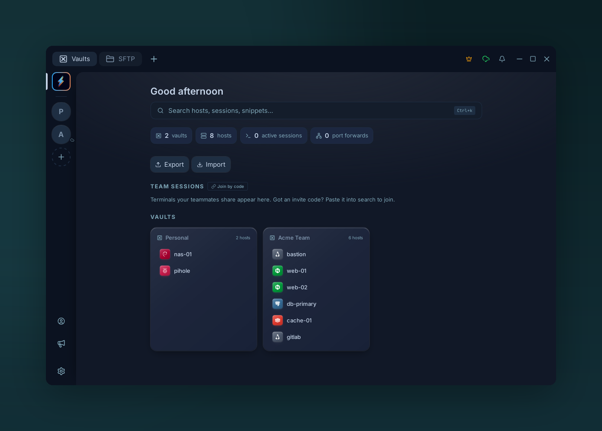

# Vaults

{ .voltius-shot }
/// caption
Vaults keep contexts separate. Your Personal vault is private to you; a Team vault is shared with — and end-to-end encrypted for — everyone you invite.
///

A **vault** is one encrypted store. Each vault has its own key — moving a host between vaults re-encrypts its secrets.

## Kinds of vaults

- **Personal** — everyone has one, and it can't be deleted. Local-only by default; syncs if you enable [Cloud sync](../sync/cloud-sync.md), [Gist sync](../sync/gist-sync.md), [Cloudflare sync](../sync/cloudflare-sync.md) or [S3 sync](../sync/s3-sync.md).
- **Your own vaults** — add more with the **+** under the vault icons in the rail (Pro). Private to you, like Personal.
- **Team vaults** — click **Share** in a vault's header and choose **Turn into a team vault** (cloud account, Teams plan or higher). Everything already in it moves across, shared with the members you invite; access is server-enforced. See [Team vaults](../teams/team-vaults.md).

## What's in a vault

Each vault holds its own set of:

- Hosts
- Keys
- Identities
- Snippets
- Folders & tags

## Vault rail

- Click a vault in the rail on the left to open it. Every tab — Hosts, Keychain, Snippets… — then shows that vault's contents.
- The Voltius logo at the top of the rail opens **Home**, which lists every vault you can access with its hosts.
- Right-click a vault, or open the menu next to its name, for **Share…**, **Members** and **Roles** (team vaults), **Rename…**, **Make private…** (team vault owner), **Delete vault…** (not Personal) and **Leave vault…** (team members).

!!! warning "Lost master password = lost vault"
    Personal vaults locked with a master password have no recovery path. Voltius does not hold an escrow key. Back up with **Export** on Home or **Import/Export** in the vault toolbar, or enable [Cloud sync](../sync/cloud-sync.md).
