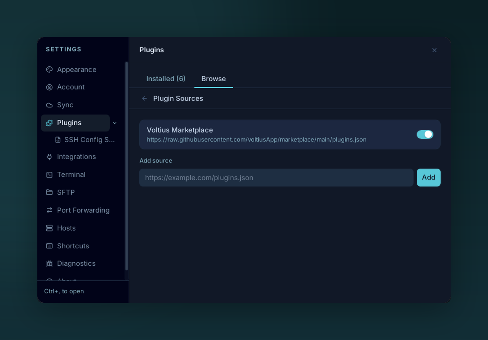

# Custom repos

{ .voltius-shot }
/// caption
Add your own plugin source by URL under Plugin Sources.
///

Point Voltius at a different registry — your team's, or a fork.

## Adding one

**Settings → Plugins → Browse → Manage sources** (the sliders icon beside search), then paste the URL under **Add source** and click **Add**.

A source is a URL to a `plugins.json` file with the same schema as the [official marketplace](https://github.com/VoltiusApp/marketplace/blob/main/plugins.json). Examples:

- `https://raw.githubusercontent.com/your-org/voltius-plugins/main/plugins.json`
- `https://internal.example.com/voltius/plugins.json`

Sources must be `http://` or `https://`. For local development, skip the registry: put your plugin's folder in `$APP_DATA/plugins/<id>/` and click **Scan for local plugins** on the **Installed** tab.

Multiple sources can be active at once — Voltius lists all of them together in the Browse tab, each card tagged with its source. Avoid reusing an `id` from another source: both entries are shown.

## Schema

```json
[
  {
    "id": "my-plugin",
    "name": "My Plugin",
    "author": "acme",
    "description": "What it does.",
    "repo": "acme/voltius-plugin-my-plugin",
    "version": "1.0.0",
    "hash": "<sha256 of index.js>",
    "permissions": ["storage"],
    "minAppVersion": "0.1.0",
    "tags": ["productivity"],
    "theme": false
  }
]
```

Without `hash` the plugin installs as **Unverified**. See the [marketplace CONTRIBUTING guide](https://github.com/VoltiusApp/marketplace/blob/main/CONTRIBUTING.md#entry-schema) for the full reference.

!!! warning "Trust the source"
    Plugins run JavaScript in the same process as the app. Only add registries you trust.
