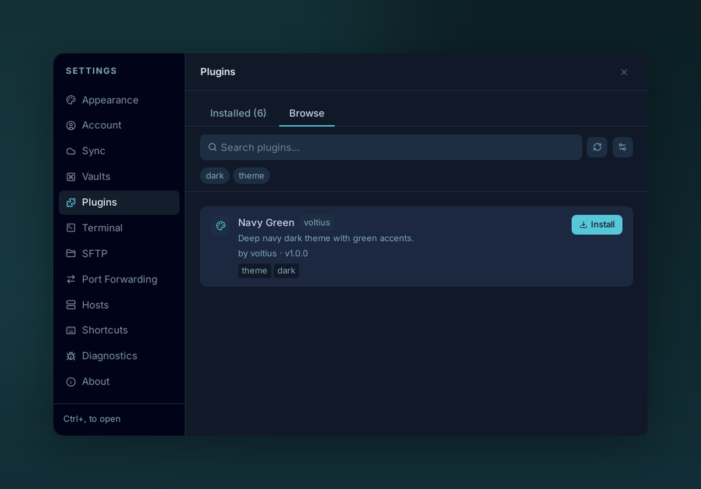

# Installing

{ .voltius-shot }
/// caption
Browse the marketplace and install plugins with a single click.
///

**Settings → Plugins → Browse** is the marketplace.

## Browsing

- **Search** — filter by name or tag.
- **Tags** — productivity, theme, import, sync…
- **Theme toggle** — show themes only / hide themes.

Each card lists the plugin's declared permissions before install — review them before clicking **Install**. Treat that list as disclosure, not a guarantee: a plugin runs with the app's full privileges (see [What plugins can do](index.md)), so installing one is a matter of trusting its source.

## Installing a plugin

Click **Install**. Voltius fetches `index.js` + `manifest.json` from the plugin's GitHub release, verifies the manifest, and writes them under `$APP_DATA/plugins/<id>/`.

The plugin appears in **Installed** but is **disabled by default** for marketplace installs. Toggle it on after reviewing what it does.

## Updating

The Browse tab shows an **Update** badge when a newer release is available. Click to fetch and replace; settings persist.

!!! warning "Permission scope"
    Permissions in `manifest.json` are declared up front. If a plugin update adds a permission, Voltius prompts before enabling — explicitly accept or skip the update.
