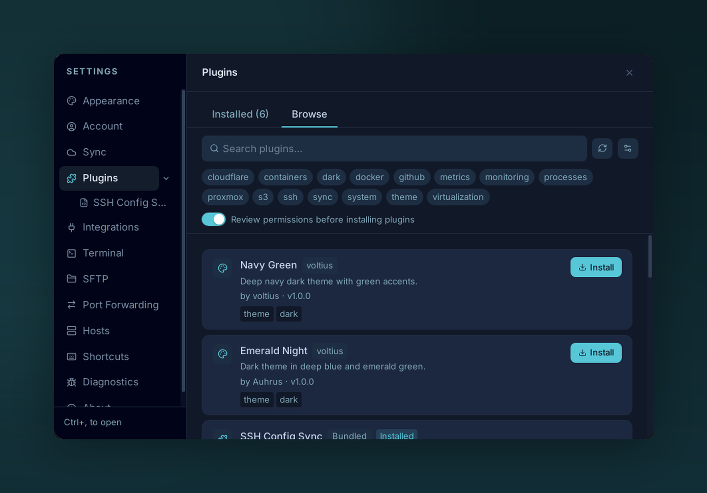

# Installing

{ .voltius-shot }
/// caption
Browse the marketplace and install plugins from the catalogue.
///

**Settings → Plugins → Browse** is the marketplace.

## Browsing

- **Search** — filter by name or description.
- **Tags** — click a tag chip (theme, sync, docker, monitoring…) to show only plugins with that tag.
- **Review permissions before installing plugins** — on by default; shows each plugin's permissions in a confirmation dialog before it installs. A plugin that asks for a [gated](api-reference.md#gated-permissions) permission always shows it.

Clicking **Install** opens a dialog listing the plugin's declared permissions — review them before confirming. Treat that list as disclosure, not a guarantee: a plugin runs with the app's full privileges (see [What plugins can do](index.md)), so installing one is a matter of trusting its source.

## Installing a plugin

Click **Install**. Voltius fetches `index.js` + `manifest.json` from the plugin's GitHub release, checks that the manifest's `id` matches the listing, and writes them under `$APP_DATA/plugins/<id>/`. If the marketplace listing carries a **content hash** of the bundle, Voltius checks the downloaded `index.js` against it and blocks the install on mismatch.

The plugin appears in **Installed** and is enabled straight away — installing is the opt-in. Use its toggle to turn it off.

## Verified vs. unverified

An installed plugin shows an **Unverified** badge when the listing it came from didn't carry a bound content hash — Voltius downloaded and wrote the bundle but couldn't confirm it matches a specific reviewed artifact. Every listing in the official marketplace carries a hash (its CI rejects entries without one), so you'll mostly see this badge on plugins from a [custom source](custom-repos.md) whose listing has no `hash`. Local (developer) plugins are never badged.

When a listing *does* carry a hash, a mismatch is refused outright — the reviewed bytes and the executed bytes must agree.

## Updating

When a plugin's source publishes a newer release, Voltius detects it — by version, or by a changed content hash at the same version — and shows an **Update** button on the plugin in **Settings → Plugins → Installed**, and its version chip reads `v{current} → {new}`. Click it to fetch the latest `index.js` + `manifest.json`, re-check the content hash (if the listing has one), and apply the new bundle in place. Your plugin settings live separately from the bundle, so they survive the update. Updates are never applied in the background — you choose when to update.

!!! warning "Re-consent on new permissions"
    If the new version declares **permissions the installed version didn't have** — including the [gated](api-reference.md#gated-permissions) ones — Voltius shows a non-skippable consent dialog listing the added permissions before it applies the update. An update that doesn't request anything new applies without a prompt.
