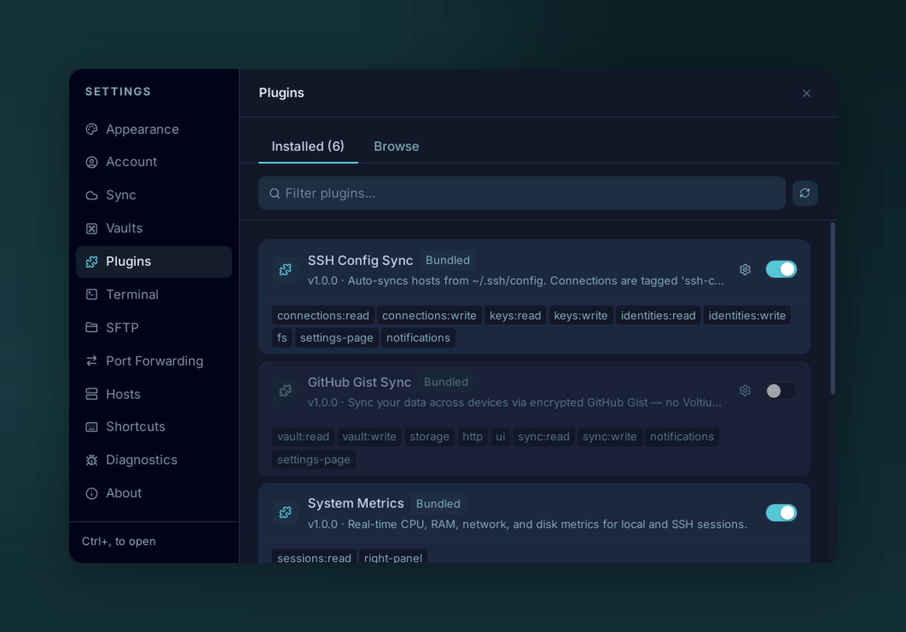

# Managing

{ .voltius-shot }
/// caption
Settings → Plugins → Installed — every plugin with its version and permission scopes.
///

**Settings → Plugins → Installed.**

## Per-plugin actions

| Action | What |
| --- | --- |
| **Toggle** | Enable / disable. Disabling calls the plugin's cleanup hook. |
| **Configure** | Opens the plugin's settings page (or a generated form from `contributes.configuration`). |
| **Reload** | Re-run the plugin's `register` function. Use after editing a local plugin. |
| **Update** | Pull a newer release if available. |
| **Uninstall** | Removes the folder under `$APP_DATA/plugins/`. Per-plugin storage and vault entries are kept unless you also clear them. |

## Plugin data locations

| Item | Path |
| --- | --- |
| Code | `$APP_DATA/plugins/<id>/` |
| Storage (`api.storage`) | `$APP_DATA/plugin-data/<id>.json` |
| Vault (`api.vault`) | Inside your Voltius vault, scoped to `plugin:<id>:*` |
| Logs | Console output is prefixed `[plugin:<id>]` |

`$APP_DATA` is `%APPDATA%\Voltius\` (Windows), `~/Library/Application Support/Voltius/` (macOS), `~/.config/Voltius/` (Linux).
