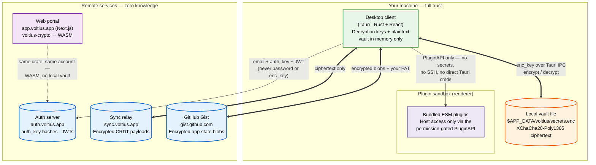
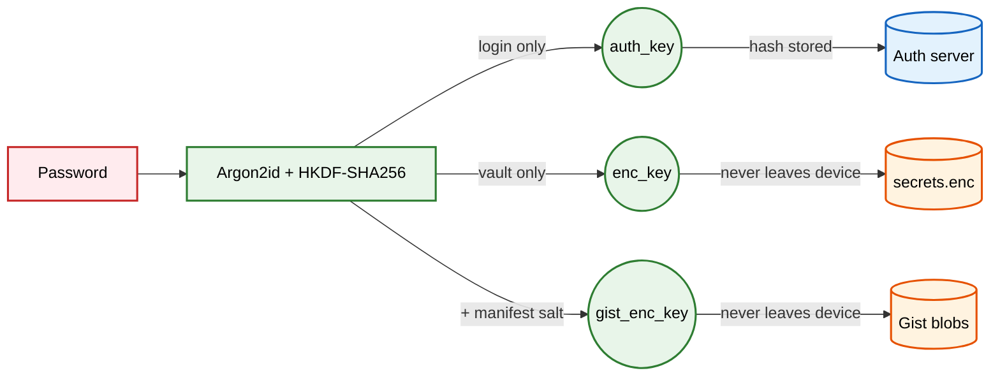

# Architecture

Voltius runs as three independent components plus the optional sync layer.

## Components

| Component | Where it runs | What it holds |
| --- | --- | --- |
| **Desktop client** | Your machine (Tauri / Rust + React) | Decryption keys, plaintext vault in memory only |
| **Local vault file** | `$APP_DATA/voltius/secrets.enc` | XChaCha20-Poly1305 ciphertext, on disk |
| **Auth server** | `auth.voltius.app` (or your self-host) | `auth_key` hashes, account metadata, JWTs |
| **Sync relay** | `sync.voltius.app` (or your self-host) | Encrypted CRDT payloads |
| **Web portal** | `app.voltius.app` (Next.js) | Same `voltius-crypto` crate, compiled to WASM |
| **Gist host** (Gist sync only) | `gist.github.com` (your account) | Encrypted per-device app-state blobs |

## Trust boundaries

- **Inside the Tauri process** — full trust. The Rust backend never exposes raw secrets to the JS frontend except via Tauri IPC, and even then only when explicitly needed (e.g. to display a password in the UI).
- **The auth server** — sees `auth_key` (an Argon2id derivation), email, machine fingerprints, JWTs. Never sees the password or `enc_key`.
- **The sync relay** — sees encrypted blobs. Cannot decrypt them.
- **GitHub Gist** — same: encrypted blobs only, plus the PAT you provided.

## Key separation

Three independent keys are derived from the same password:

| Key | Use |
| --- | --- |
| `auth_key` | Sent to the auth server for login. Server stores a hash of this — not the password. |
| `enc_key` | Encrypts the local vault. Never leaves the device. |
| `gist_enc_key` | Encrypts Gist-sync blobs. Derived from a passphrase + manifest salt; distinct from `enc_key`. |

Compromise of one does not yield the others.

## Plugin sandbox

Plugins run as bundled ESM modules in the renderer process. They access the host only through `PluginAPI`, which is permission-gated. Plugins **cannot**:

- Read terminal output or inject keystrokes.
- Read another plugin's vault keys.
- Call Tauri commands directly.
- Open SSH tunnels.

See the [marketplace docs](https://github.com/VoltiusApp/marketplace#what-plugins-cannot-do) for the full list.
