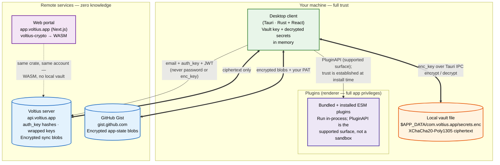
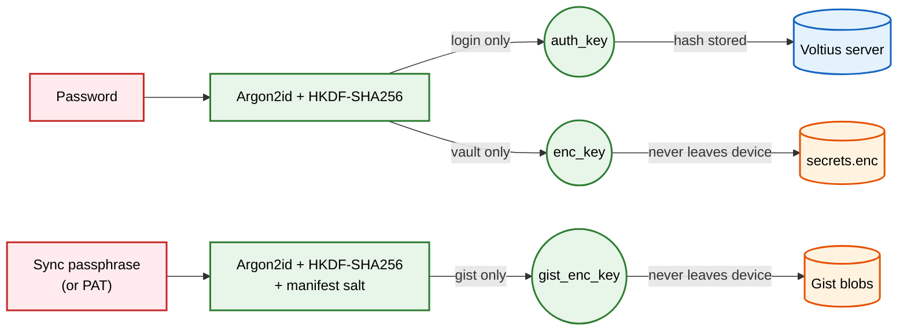

# Architecture

```mermaid
flowchart TD
    classDef local fill:#fff3e0,stroke:#e65100,stroke-width:2px,color:#000;
    classDef secure fill:#e8f5e9,stroke:#2e7d32,stroke-width:2px,color:#000;
    classDef remote fill:#e3f2fd,stroke:#1565c0,stroke-width:2px,color:#000;
    classDef wasm fill:#f3e5f5,stroke:#6a1b9a,stroke-width:2px,color:#000;
    classDef plugin fill:#ede7f6,stroke:#4527a0,stroke-width:2px,color:#000;

    subgraph Device ["Your machine — full trust"]
        direction TB
        Client["Desktop client\n(Tauri · Rust + React)\nVault key + decrypted secrets\nin memory"]:::secure
        Vault[("Local vault file\n$APP_DATA/com.voltius.app/secrets.enc\nXChaCha20-Poly1305 ciphertext")]:::local
        subgraph PluginBox ["Plugins (renderer — full app privileges)"]
            Plugins["Bundled + installed ESM plugins\nRun in-process; PluginAPI is the\nsupported surface, not a sandbox"]:::plugin
        end
        Client <==>|"enc_key over Tauri IPC\nencrypt / decrypt"| Vault
        Client -->|"PluginAPI (supported surface);\ntrust is established at install time"| Plugins
    end

    subgraph Cloud ["Remote services — zero knowledge"]
        direction TB
        Server[("Voltius server\napi.voltius.app\nauth_key hashes · wrapped keys\nEncrypted sync blobs")]:::remote
        Portal["Web portal\napp.voltius.app (Next.js)\nvoltius-crypto → WASM"]:::wasm
        Gist[("GitHub Gist\ngist.github.com\nEncrypted app-state blobs")]:::remote
    end

    Client -->|"email + auth_key + JWT\n(never password or enc_key)"| Server
    Client <==>|"ciphertext only"| Server
    Client <==>|"encrypted blobs + your PAT"| Gist
    Portal -.->|"same crate, same account —\nWASM, no local vault"| Server
```

Voltius runs as a client, a local vault file and one server, plus the optional sync layers.

## Components

| Component | Where it runs | What it holds |
| --- | --- | --- |
| **Desktop client** | Your machine (Tauri / Rust + React) | Decrypted secrets and vault key in memory; master password (or random key) in the OS keychain for auto-unlock until you lock; host, snippet and folder records as plain JSON in the config directory |
| **Local vault file** | `$APP_DATA/com.voltius.app/secrets.enc` (the OS data directory) | XChaCha20-Poly1305 ciphertext, on disk |
| **Voltius server** | `api.voltius.app` (or your self-host) | `auth_key` hashes, account metadata, public keys, password-wrapped user keys, per-member wrapped team keys, encrypted per-device sync blobs and team vault ciphertext; issues JWTs |
| **Web portal** | `app.voltius.app` (Next.js) | Same `voltius-crypto` crate, compiled to WASM |
| **Gist host** (Gist sync only) | `gist.github.com` (your account) | Encrypted per-device app-state blobs |

## Trust boundaries

- **Inside the Tauri process** — full trust, and that includes the webview: the vault key is held in the frontend's memory and passed to Rust over IPC, and decrypted secrets are returned to the frontend whenever a feature needs them (connecting, editing, sync merge). Plugins run in the same renderer, so they share that trust.
- **The Voltius server** — one service handles both authentication and sync. It sees `auth_key` (an Argon2id derivation), email, machine fingerprints, JWTs, and your encrypted blobs. It never sees the password or `enc_key`, so it cannot decrypt anything it stores.
- **GitHub Gist** — same: encrypted blobs only, plus the PAT you provided.

## Key separation

Two keys are derived from your password, and a third, independent one protects Gist sync:

| Key | Use |
| --- | --- |
| `auth_key` | Sent to the server for login. The server stores a hash of this — not the password. |
| `enc_key` | Local accounts: encrypts the local vault. Cloud accounts: the key-encryption key that wraps a random data key (DEK) and your X25519 private key; the DEK encrypts the vault and sync blobs, and only the wrapped copy is stored on the server. Never leaves the device. |
| `gist_enc_key` | Encrypts Gist-sync blobs. Derived from your Sync Passphrase (or, if you set none, your GitHub PAT) + the manifest salt; independent of your password. |

```mermaid
flowchart LR
    classDef cleartext fill:#ffebee,stroke:#c62828,stroke-width:2px,color:#000;
    classDef secure fill:#e8f5e9,stroke:#2e7d32,stroke-width:2px,color:#000;
    classDef remote fill:#e3f2fd,stroke:#1565c0,stroke-width:2px,color:#000;
    classDef local fill:#fff3e0,stroke:#e65100,stroke-width:2px,color:#000;

    Pass["Password"]:::cleartext
    KDF["Argon2id + HKDF-SHA256"]:::secure

    Pass --> KDF
    KDF -->|"login only"| AuthKey(("auth_key")):::secure
    KDF -->|"vault only"| EncKey(("enc_key")):::secure
    GistPass["Sync passphrase\n(or PAT)"]:::cleartext --> GistKDF["Argon2id + HKDF-SHA256\n+ manifest salt"]:::secure
    GistKDF -->|"gist only"| GistKey(("gist_enc_key")):::secure

    AuthKey -->|"hash stored"| Server[("Voltius server")]:::remote
    EncKey -->|"never leaves device"| Disk[("secrets.enc")]:::local
    GistKey -->|"never leaves device"| Blobs[("Gist blobs")]:::local
```

Compromise of one does not yield the others.

## Plugins

Plugins run as ESM modules **in the renderer process, with the app's full privileges** — they are not sandboxed or isolated from the host. `PluginAPI` is the *supported* surface: stable across releases, permission-declared, and rendered consistently. It omits another plugin's vault keys and direct Tauri commands, and puts terminal I/O and port-forward tunnels behind gated permissions the user approves at install — but those limits are **scope, not a security boundary**. A plugin is trusted code, the same as a VS Code or Obsidian extension.

The trust boundary is therefore **install time**, not runtime:

- Marketplace submissions are reviewed before listing.
- Marketplace installs show the plugin's declared permissions for approval first (always for gated permissions; for the rest while the install-review toggle is on, which is the default), and the plugin is enabled once you approve.
- When a listing carries a content hash of its bundle, the install is verified against it and refused on mismatch — binding the reviewed artifact to the executed one (installs from listings without a bound hash are marked **Unverified**; every official marketplace listing carries one).
- Only install plugins from a source you trust.

See [Plugins → Developing](../plugins/developing.md#what-pluginapi-covers) for what the supported surface does and doesn't cover.
