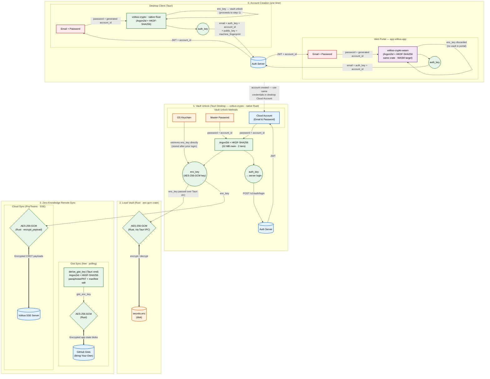

# Sync protocol

Voltius follows a **Zero-Knowledge** protocol for every sync path. All data leaving your device is strictly ciphertext — the auth server, the SSE relay, and GitHub all have zero knowledge of your vault contents.

## Architecture

## Layers explained

### 0. Account creation

A one-time step. Both the web portal and desktop client derive an `auth_key` from your email + password using **Argon2id + HKDF-SHA256**. The portal discards the `enc_key` (it has no vault); the desktop client keeps it for vault unlock.

### 1. Vault unlock

The desktop client unlocks your local vault via one of three methods:

- **OS Keychain** — retrieves `enc_key` directly from your system's secure storage.
- **Master Password** — re-derives `enc_key` via Argon2id (32 MB mem, 2 iters) + HKDF-SHA256.
- **Cloud Account** — same derivation, plus posts `auth_key` to the auth server to receive a JWT.

### 2. Local vault

Secrets are stored on disk in `secrets.enc`, encrypted with AES-256-GCM via the `aes-gcm` Rust crate. The `enc_key` never leaves the Tauri Rust process.

### 3. Remote sync

Two zero-knowledge transports:

- **Gist Sync** (free) — encrypted per-device app-state blobs polled to/from your private GitHub Gist using a separately-derived `gist_enc_key`; entity records are merged locally on import.
- **Cloud Sync** (Pro/Teams) — encrypted CRDT payloads over SSE to the Voltius relay server.

!!! note "What the server never sees"
    Your password, your `enc_key`, your decrypted vault, or any plaintext connection metadata. The server only sees an opaque `auth_key` for login and ciphertext for sync.
