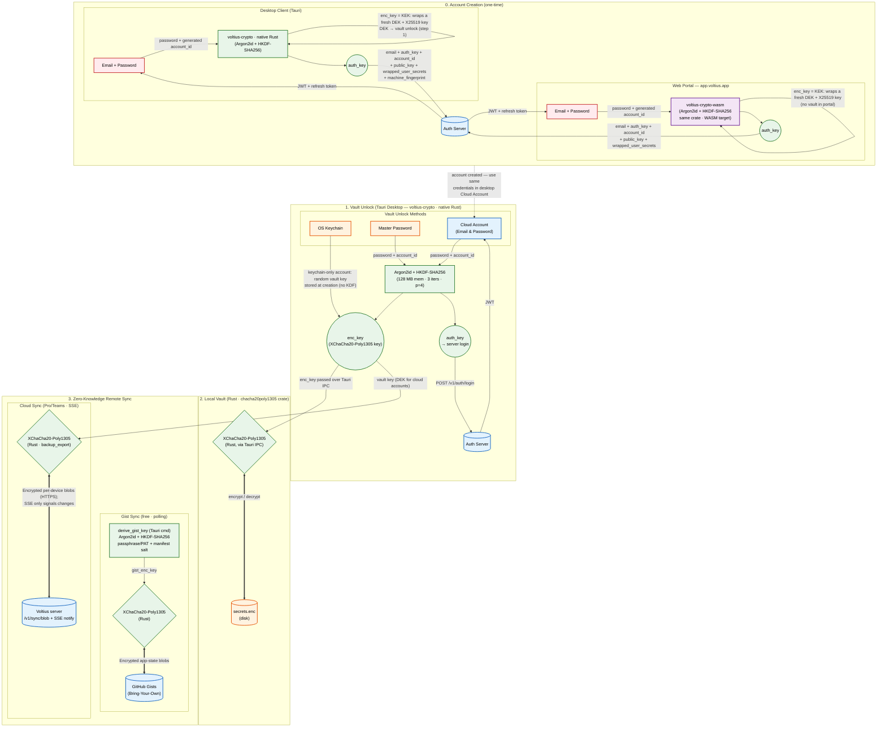

# Sync protocol

Voltius follows a **Zero-Knowledge** protocol for every sync path. Your vault contents leave the device only as ciphertext. The auth server, the SSE relay and GitHub see account and routing metadata (email, account id, device ids, timestamps) but nothing of what is in your vault.

## Architecture

```mermaid
flowchart TD
    classDef cleartext fill:#ffebee,stroke:#c62828,stroke-width:2px,color:#000;
    classDef secure fill:#e8f5e9,stroke:#2e7d32,stroke-width:2px,color:#000;
    classDef local fill:#fff3e0,stroke:#e65100,stroke-width:2px,color:#000;
    classDef remote fill:#e3f2fd,stroke:#1565c0,stroke-width:2px,color:#000;
    classDef wasm fill:#f3e5f5,stroke:#6a1b9a,stroke-width:2px,color:#000;
    classDef note fill:#f9f9f9,stroke:#666,stroke-width:1px,stroke-dasharray: 5 5,color:#333;

    subgraph RegLayer ["0. Account Creation (one-time)"]
        direction LR

        subgraph PortalReg ["Web Portal — app.voltius.app"]
            PortalCreds["Email + Password"]:::cleartext
            WasmKDF["voltius-crypto-wasm\n(Argon2id + HKDF-SHA256\nsame crate · WASM target)"]:::wasm
            AuthKeyPortal(("auth_key")):::secure
            PortalCreds -->|"password + generated account_id"| WasmKDF
            WasmKDF -->|"enc_key = KEK: wraps a fresh DEK + X25519 key\n(no vault in portal)"| WasmKDF
            WasmKDF --> AuthKeyPortal
        end

        subgraph DesktopReg ["Desktop Client (Tauri)"]
            DesktopCreds["Email + Password"]:::cleartext
            NativeKDF["voltius-crypto · native Rust\n(Argon2id + HKDF-SHA256)"]:::secure
            AuthKeyDesktop(("auth_key")):::secure
            DesktopCreds -->|"password + generated account_id"| NativeKDF
            NativeKDF -->|"enc_key = KEK: wraps a fresh DEK + X25519 key\nDEK → vault unlock (step 1)"| NativeKDF
            NativeKDF --> AuthKeyDesktop
        end

        RegServer[("Auth Server")]:::remote
        AuthKeyPortal -->|"email + auth_key + account_id\n+ public_key + wrapped_user_secrets"| RegServer
        AuthKeyDesktop -->|"email + auth_key + account_id\n+ public_key + wrapped_user_secrets\n+ machine_fingerprint"| RegServer
        RegServer -->|"JWT + refresh token"| PortalCreds
        RegServer -->|"JWT + refresh token"| DesktopCreds
    end

    subgraph AuthLayer ["1. Vault Unlock (Tauri Desktop — voltius-crypto · native Rust)"]
        direction TB
        subgraph Methods ["Vault Unlock Methods"]
            direction LR
            OS["OS Keychain"]:::local
            MP["Master Password"]:::local
            Cloud["Cloud Account\n(Email & Password)"]:::remote
        end

        KDF["Argon2id + HKDF-SHA256\n(128 MB mem · 3 iters · p=4)"]:::secure
        EncKey(("enc_key\n(XChaCha20-Poly1305 key)")):::secure
        AuthKey(("auth_key\n→ server login")):::secure

        Cloud -->|"password + account_id"| KDF
        MP -->|"password + account_id"| KDF
        OS -->|"keychain-only account: random vault key\nstored at creation (no KDF)"| EncKey
        KDF --> EncKey
        KDF --> AuthKey
        AuthKey -->|"POST /v1/auth/login"| AuthServer[("Auth Server")]:::remote
        AuthServer -->|"JWT"| Cloud
    end

    RegLayer -.->|"account created — use same\ncredentials in desktop Cloud Account"| Cloud

    subgraph VaultLayer ["2. Local Vault (Rust · chacha20poly1305 crate)"]
        XChaCha{"XChaCha20-Poly1305\n(Rust, via Tauri IPC)"}:::secure
        LocalStore[("secrets.enc\n(disk)")]:::local
        XChaCha <==>|"encrypt / decrypt"| LocalStore
    end

    EncKey -->|"enc_key passed over Tauri IPC"| XChaCha

    subgraph SyncLayer ["3. Zero-Knowledge Remote Sync"]
        direction LR

        subgraph GistSync ["Gist Sync (free · polling)"]
            direction TB
            GistKDF["derive_gist_key (Tauri cmd)\nArgon2id + HKDF-SHA256\npassphrase/PAT + manifest salt"]:::secure
            GistAead{"XChaCha20-Poly1305\n(Rust)"}:::secure
            Gist[("GitHub Gists\n(Bring-Your-Own)")]:::remote
            GistKDF -->|"gist_enc_key"| GistAead
            GistAead <==>|"Encrypted app-state blobs"| Gist
        end

        subgraph CloudSync ["Cloud Sync (Pro/Teams · SSE)"]
            direction TB
            SseAead{"XChaCha20-Poly1305\n(Rust · backup_export)"}:::secure
            SSE[("Voltius server\n/v1/sync/blob + SSE notify")]:::remote
            SseAead <==>|"Encrypted per-device blobs (HTTPS);\nSSE only signals changes"| SSE
        end
    end

    EncKey -->|"vault key (DEK for cloud accounts)"| SseAead
```

## Layers explained

### 0. Account creation

A one-time step. Both the web portal and the desktop client generate a random `account_id` and derive `auth_key` and `enc_key` from your password with **Argon2id (salt = account_id) + HKDF-SHA256**. `enc_key` acts as a key-encryption key: it wraps a freshly generated data key (DEK) and X25519 private key, and only that wrapped bundle is uploaded. The portal has no vault; the desktop client goes on to unlock its vault with the DEK.

### 1. Vault unlock

The desktop client unlocks your local vault via one of three methods:

- **OS Keychain** — a keychain-only account has no password: its random vault key is stored in your system's secure storage and read back directly. Password accounts also keep the master password there for auto-unlock (until you lock the vault) and re-derive the key from it.
- **Master Password** — re-derives `enc_key` via Argon2id + HKDF-SHA256 (see [Encryption](encryption.md) for parameters).
- **Cloud Account** — same derivation, plus posts `auth_key` to the auth server, which returns a JWT and your wrapped key bundle; `enc_key` unwraps the DEK that opens the vault.

### 2. Local vault

Secrets are stored on disk in `secrets.enc`, encrypted with XChaCha20-Poly1305 via the `chacha20poly1305` Rust crate. The vault key never leaves your device, but it does cross into the app's frontend: it is held in the webview's memory and handed to the Rust backend over IPC for each vault operation.

### 3. Remote sync

Three zero-knowledge transports:

- **Gist Sync** (free) — encrypted per-device app-state blobs polled to/from a secret (unlisted) GitHub Gist in your account using a separately-derived `gist_enc_key` (from your Sync Passphrase, or your PAT if you set none); entity records are merged locally on import.
- **Cloudflare Sync** (free, plugin) — the same per-device blob model against a Cloudflare Worker + R2 store you own, with a passphrase-derived key and a Bearer sync token for transport auth only.
- **Cloud Sync** (Pro/Teams) — encrypted per-device blobs uploaded to and fetched from the Voltius server over HTTPS, CRDT-merged locally; an SSE stream only tells other devices that a new blob is ready.

!!! note "What the server never sees"
    Your password, your `enc_key`, your decrypted vault, or any plaintext connection data. The server sees an opaque `auth_key` for login, your email and account id, your public key, password-wrapped key bundles, and ciphertext for sync with a small cleartext header (device id, timestamps).
