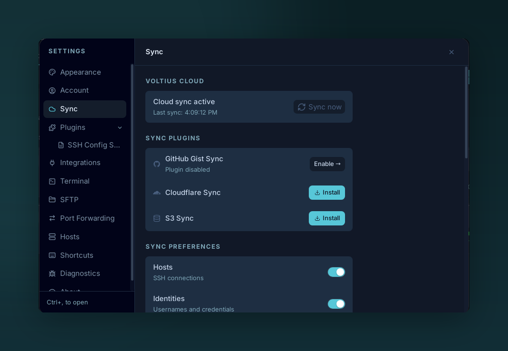

# Cloud sync

{ .voltius-shot }
/// caption
Real-time cloud sync keeps every signed-in device in step. The relay only ever sees ciphertext — and you choose exactly which object types sync.
///

Real-time sync over the Voltius relay. Pro, Teams and Business plans (including the 14-day Pro trial).

## How it works

- Sign in with your Voltius account (created on [app.voltius.app](web-portal.md) or in-app).
- The desktop derives `enc_key` (Argon2id + HKDF-SHA256) from your password.
- CRDT payloads are encrypted with your account's vault key (unwrapped by `enc_key`) and uploaded to the relay over HTTPS.
- An SSE stream tells your other devices a new payload is ready; they fetch and merge it in real time.

The relay sees ciphertext only — see [Security → Sync protocol](../security/sync-protocol.md).

## Sign in

**Settings → Sync → Sign in** (under *Voltius Cloud*), or **Sign in / Sign up** in the account menu.

| Field | Notes |
| --- | --- |
| Email | Your Voltius account |
| Master password | Used to derive both `auth_key` (server login) and `enc_key` (vault) |

If you don't have an account yet, **Create account** from the same screen.

## What syncs

- Hosts, folders, tags
- Identities, SSH keys
- Snippets, port-forwarding rules
- App preferences such as theme, UI scale, list/grid layouts, and sort modes

Most user data and preferences are included in sync. Device-specific runtime state, such as currently open terminals, is not.

## Trade-offs

| Pros | Cons |
| --- | --- |
| Real-time | Paid plan |
| Multi-device, multi-vault | Requires account |
| Team audit logs (Teams+) | — |

!!! tip "Self-host the relay"
    Anyone can run the relay on their own infrastructure — accounts on a self-hosted server get every paid feature, and Business customers also get a commercial license exception. See [Self-Hosting](../self-hosting/index.md).
