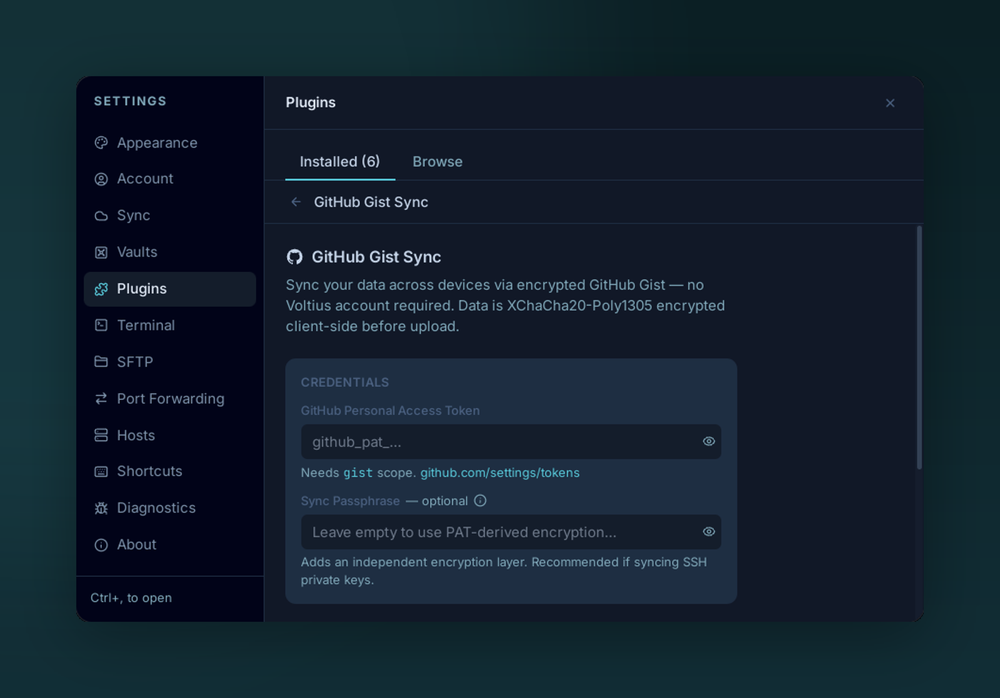

# Gist sync

{ .voltius-shot }
/// caption
Configure Gist Sync with a GitHub personal access token — everything is encrypted client-side.
///

Free, zero-knowledge, multi-device sync. Your data lives in a **private GitHub Gist** that **you** own — Voltius never sees a thing.

## How it works

1. You provide a GitHub Personal Access Token (PAT) with `gist` scope.
2. Voltius derives a **separate** encryption key (`gist_enc_key`) from your passphrase + a manifest salt.
3. The vault is exported as encrypted per-device app-state blobs and pushed to a private Gist on your account.
4. Each device polls the Gist for changes and merges remote entity records into local state.

GitHub stores ciphertext only. Your PAT is used to read and write the private Gist.

## Setup

**Settings → Sync → Gist Sync → Configure.**

1. [Generate a fine-scoped PAT](https://github.com/settings/personal-access-tokens/new) with `gist` permissions only.
2. Paste it into the **PAT** field.
3. Choose a **passphrase** — this derives the encryption key. Different from your master password.
4. On the second device: same PAT, same passphrase. Voltius detects the existing Gist and pulls.

## Trade-offs

| Pros | Cons |
| --- | --- |
| Free, no account | Polling-based (~30s lag) |
| Bring-your-own infrastructure | You manage PAT rotation |
| End-to-end encrypted | GitHub Gist size limits apply |

!!! tip "Sync plugin exclusivity"
    Only one sync plugin can be active at a time. Enabling Gist sync auto-disables Cloud sync (after exporting state), and vice versa. See [marketplace docs](https://github.com/VoltiusApp/marketplace#sync-plugin-exclusivity).
