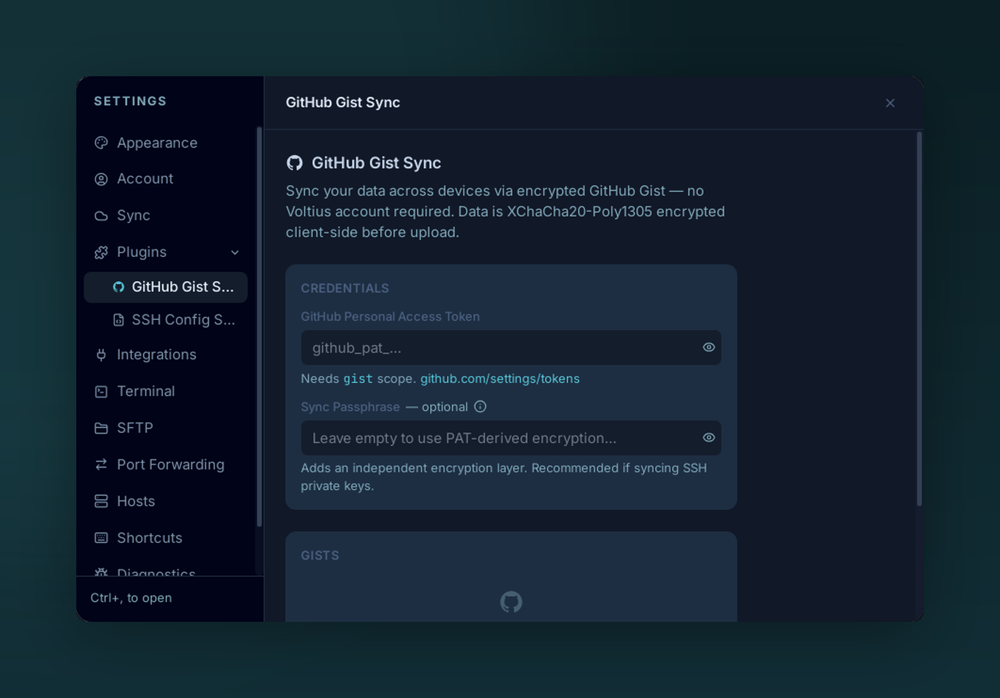

# Gist sync

{ .voltius-shot }
/// caption
Configure Gist Sync with a GitHub personal access token — everything is encrypted client-side.
///

Free, zero-knowledge, multi-device sync. Your data lives in a **secret (unlisted) GitHub Gist** that **you** own — Voltius never sees a thing.

## How it works

1. You provide a GitHub Personal Access Token (PAT) with `gist` scope.
2. Voltius derives a **separate** encryption key from your Sync Passphrase (or, if you leave it empty, from your PAT) plus a manifest salt.
3. The vault is exported as encrypted per-device app-state blobs and pushed to a secret Gist on your account.
4. Each device polls the Gist for changes and merges remote entity records into local state.

GitHub stores ciphertext only. Your PAT is used to read and write the Gist.

## Setup

**Settings → Plugins → GitHub Gist Sync** (from **Settings → Sync**, click **Enable →** on *GitHub Gist Sync*, then **Configure →**).

1. [Generate a fine-scoped PAT](https://github.com/settings/personal-access-tokens/new) with `gist` permissions only.
2. Paste it into the **GitHub Personal Access Token** field.
3. Optionally set a **Sync Passphrase** — it derives the encryption key instead of your PAT, so a leaked PAT does not expose your data. Different from your master password.
4. On the second device: same PAT, same passphrase, then **Auto-detect** and pick your Voltius gist (or link it by ID). It pulls from there.

## Trade-offs

| Pros | Cons |
| --- | --- |
| Free, no account | Polling-based (every 60 s by default, configurable) |
| Bring-your-own infrastructure | You manage PAT rotation |
| End-to-end encrypted | GitHub Gist size limits apply |

!!! tip "Multiple sync providers"
    Gist sync can run alongside Cloud sync, [Cloudflare sync](cloudflare-sync.md), [S3 sync](s3-sync.md) and other sync provider plugins — Voltius lists each one separately in the title-bar sync menu and in **Settings → Sync**. See [Building a sync provider](../plugins/sync-providers.md).
