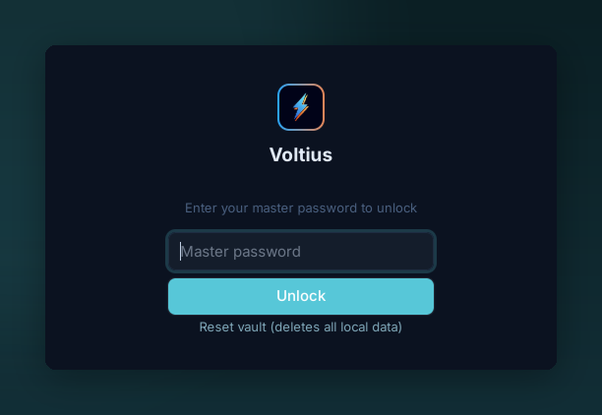

# Master password

{ .voltius-shot }
/// caption
With a master password, Voltius asks for your passphrase at every launch before decrypting the vault. There's no recovery — the key is derived from your password, never stored.
///

Lock your vault with a passphrase. Required to unlock at every launch.

## Setup

**Settings → Vaults → Personal → Change unlock method → Master password.**

- Pick a passphrase you'll remember. There is no recovery.
- Voltius derives the encryption key with **Argon2id + HKDF-SHA256** — see [Security → Encryption](../security/encryption.md) for exact parameters.

## What's encrypted

The vault file (`secrets.enc`) holds your passwords, private keys, and any other secrets — all XChaCha20-Poly1305 encrypted under the derived key.

Metadata (hostnames, names, tags) lives in a separate file and is not encrypted with this key. See [Security → Encryption](../security/encryption.md) for the full breakdown.

## Trade-offs

| Pros | Cons |
| --- | --- |
| Survives OS account compromise | Prompt at every launch |
| Portable across machines (with sync) | No recovery if forgotten |

!!! warning "No escrow"
    Voltius does not store, hash, or escrow your master password. Forget it = lose the vault. Sync to a [Gist](gist-sync.md) or [Cloud](cloud-sync.md) target so you have at least one other copy.
