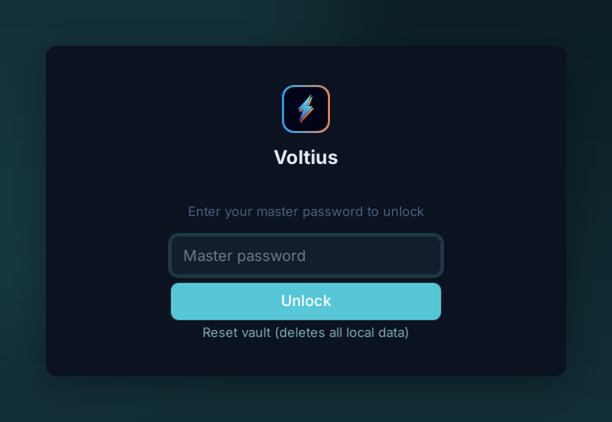

# Master password

{ .voltius-shot }
/// caption
With a master password, a locked vault stays encrypted until you enter your passphrase. There's no recovery — the key is derived from your password.
///

Lock your vault with a passphrase. Voltius keeps it in the OS keychain until you lock the vault (**Lock now**, or **Auto-lock after inactivity** with **Lock vault** chosen in Settings → Account → Session security); after that it must be entered to unlock, including at launch.

## Setup

**Settings → Account → Set a master password.** (Shown while the vault is in *Local (OS keychain)* mode.)

- Pick a passphrase you'll remember. There is no recovery.
- Voltius derives the encryption key with **Argon2id + HKDF-SHA256** — see [Security → Encryption](../security/encryption.md) for exact parameters.

## What's encrypted

The vault file (`secrets.enc`) holds your passwords, private keys, and any other secrets — all XChaCha20-Poly1305 encrypted under the derived key.

Metadata (hostnames, names, tags) lives in a separate file and is not encrypted with this key. See [Security → Encryption](../security/encryption.md) for the full breakdown.

## Trade-offs

| Pros | Cons |
| --- | --- |
| Survives OS account compromise once the vault is locked | Prompt after every lock |
| Portable across machines (with sync) | No recovery if forgotten |

!!! warning "No escrow"
    Voltius never sends your master password anywhere — it only caches it in this device's OS keychain while the vault is unlocked. Forget it = lose the vault. Sync to a [Gist](gist-sync.md), [Cloudflare](cloudflare-sync.md), [S3](s3-sync.md) or [Cloud](cloud-sync.md) target so you have at least one other copy.
