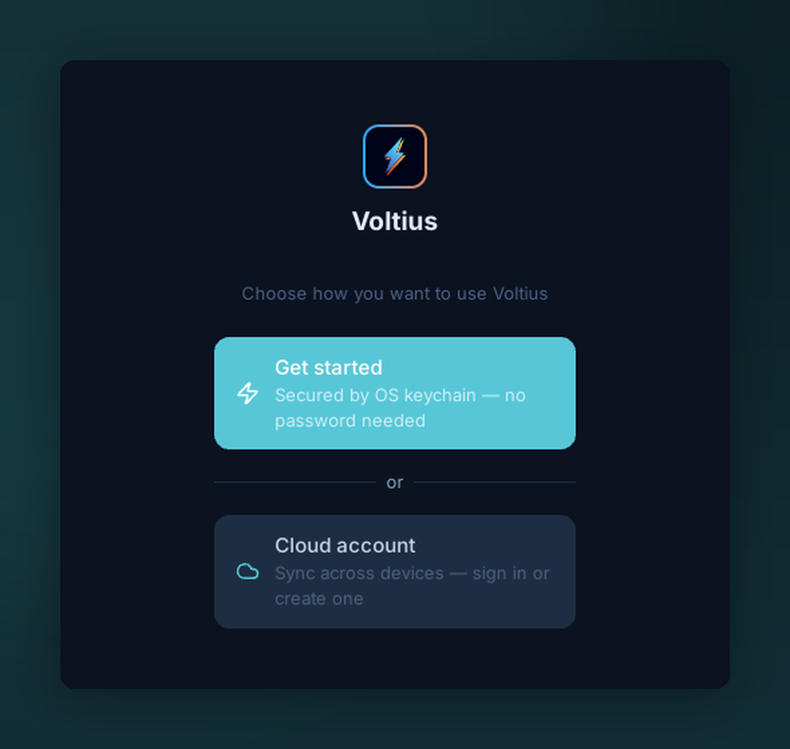

# OS keychain

{ .voltius-shot }
/// caption
On first run, choose how to protect your vault. “Get started” stores the encryption key in your OS keychain — no master password, no account.
///

Stores your vault encryption key in your operating system's native secure storage:

| OS | Backend |
| --- | --- |
| macOS | Keychain |
| Windows | Credential Manager |
| Linux | Secret Service (libsecret) |

## What you get

- No master password prompt at launch.
- Vault is encrypted at rest with XChaCha20-Poly1305 (key lives in the OS keychain).
- No network involvement — no account required.

## Trade-offs

| Pros | Cons |
| --- | --- |
| Most convenient | Single device — no sync |
| OS-grade key storage | Tied to your OS user account |

If you want sync, layer on [Gist sync](gist-sync.md) (free) or [Cloud sync](cloud-sync.md) (Pro/Teams) — the OS keychain remains the local unlock mechanism either way.

!!! warning "Locked out of your OS account"
    If you lose access to your OS user account, the keychain entry is gone with it. There's no recovery path from Voltius — sync or [export](../organization/import-export.md) for backup.
