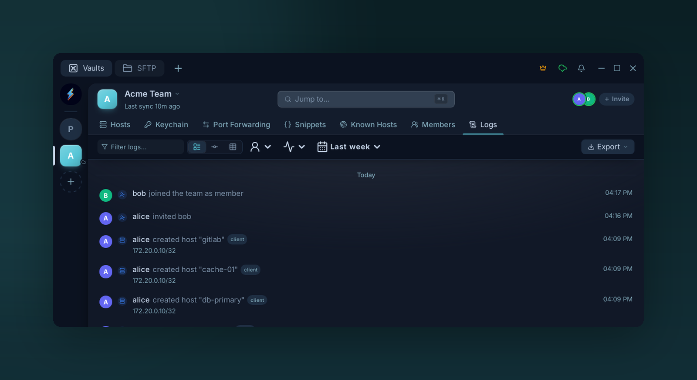

# Audit logs

{ .voltius-shot }
/// caption
Team actions are recorded — who invited whom, who created or edited a host, and when. Filter by member, event type, or date range, and export for compliance.
///

Membership, role and permission changes are logged by the server. Host, identity, key, snippet, folder and port-forward edits, connections and revealed secrets are reported by the app and marked **client**.

## What's recorded

| Event | Fields |
| --- | --- |
| Connection start / end | user, host, identity used (own / team), key fingerprint, IP, timestamp |
| Secret revealed | user, target, timestamp, IP |
| Host / snippet / folder / port forward create, edit, delete | user, target |
| Identity / key write | user, target |
| Member invite / join / remove | user, target (and the role, for invites and joins) |
| Role change | user, target, role assigned or removed |
| AI agent (MCP) actions | user, tool, target |

## Where

- **Logs** tab in the vault. A team vault shows the team's log (needs **View audit log**); a personal vault shows a log kept on this device. The log follows the single vault selected in the rail.
- **Export** — CSV / JSON via the toolbar.

## Filters

- Date range
- User
- Event type
- Free-text search

## Retention

Team logs are kept for 30 days on every plan, then removed by a daily cleanup. A personal vault's on-device log keeps its most recent 5,000 entries.
