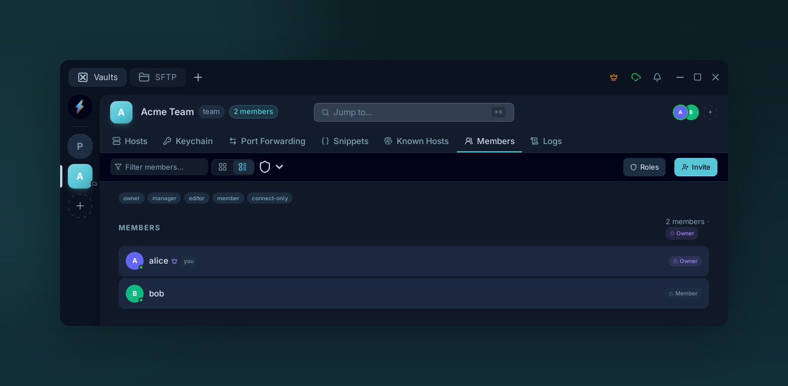

# Members

{ .voltius-shot }
/// caption
The Members tab lists everyone with access to the team vault and their role. Invite by email, filter by role, and manage seats from here.
///

## Inviting

**Members tab → Invite.**

Enter an email. The invitee receives a sign-up link (via Resend). When they create an account, your vault keys are wrapped under their public key and pushed to them.

Pending invites appear at the top of the Members list until accepted or revoked.

## Removing

Right-click a member → **Remove**.

- Their copy of every vault key is deleted server-side.
- They retain anything already cached locally (rotate secrets on real systems if needed — see [Team vaults](team-vaults.md)).
- The seat is freed in your subscription.

## Seats

The Members tab shows seat usage in the header (e.g. `3 / 5 used`). When you hit the cap, **Buy more seats** in the same header opens checkout. See [Billing](billing.md).

!!! tip
    Invites stay open for 7 days. After that, revoke and re-invite.
