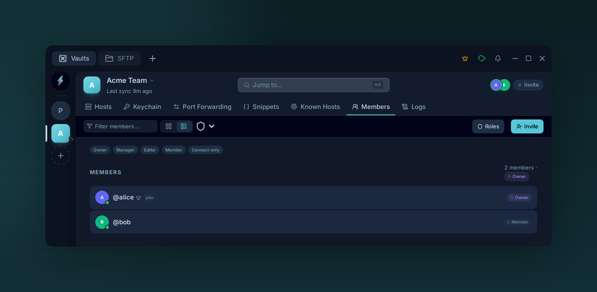

# Members

{ .voltius-shot }
/// caption
The Members tab lists everyone with access to the team vault and their role. Invite by email, filter by role, and manage seats from here.
///

## Inviting

Click **Invite** in the Members tab toolbar. In the panel that opens:

- **Search handle or enter email** — custom handles match on part of a name; a generated handle like `rapid-violet-8884` has to be typed in full, or use their email.
- **Name in this team** — optional. Teammates see it instead of the handle, and only admins can change it.
- **Initial Roles** — pick at least one before inviting. See [Roles](roles.md).

The panel also shows your seat usage, counted across every team you own.

You can invite from the vault itself too: **Invite** (or **Share**) in the vault header opens the same search on its **Invite** tab, with **Manager**, **Editor**, **Member** or **Connect-Only** as the role they join with. The **Links** tab creates a join link instead.

What the invitee sees:

- **They already have an account** — the vault appears in their sidebar with a pending marker, plus a notification. Clicking it shows who invited them and as what role, with **Accept** and **Decline**.
- **They don't have one yet** — they get an email with a link to accept, and sign up from there. A self-hosted server only sends it when [email is configured](../self-hosting/environment.md#email).

Once they accept, a teammate who holds the vault key wraps a copy under their public key automatically. Until then the **People** tab of the vault's **Share** popover shows them as *Waiting for a key*, and anyone who can manage members can click **Grant now** there.

Pending invites appear at the top of the Members list until accepted or revoked, with how long they have left; revoke one there, or send an expired one again. The **People** tab of the **Share** popover can also copy a pending invite's link.

## Removing

In the Members tab, right-click a member → **Kick**, or select them and click **Remove from team** under **Danger Zone** in the side panel. Select several members and right-click to kick them all at once. A confirmation spells out what happens before anyone is removed.

The **×** next to a person in the vault's **Share** popover removes them too, without that confirmation.

You need the permission to manage members, and the owner can't be removed.

When a member is removed:

- Their copy of every vault key is deleted server-side.
- The vault's contents are wiped from their devices, and the vault key is rotated automatically — see [Team vaults](team-vaults.md#leaving-removing).
- They keep anything they already saw: change those credentials on the real systems.
- The seat is freed in your subscription.

## Seats

The Members tab shows seat usage in the header (e.g. `3 / 5 used`). When you hit the cap, **Buy more seats** in the same header opens checkout. See [Billing](billing.md).

!!! tip
    Invites stay open for 7 days. An expired one can be sent again from the Members list.
