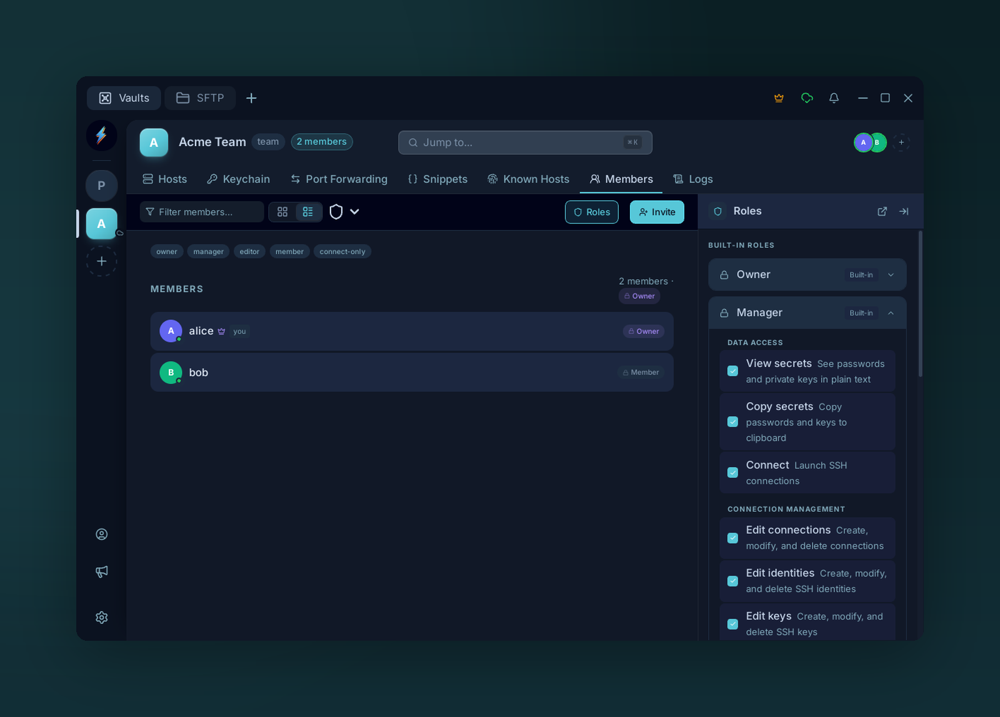
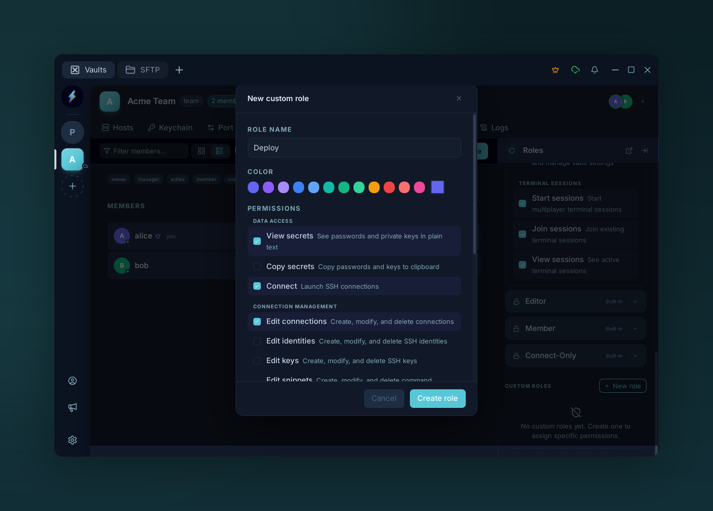

# Roles

{ .voltius-shot }
/// caption
Every member gets a role. Built-in roles (Owner, Manager, Editor, Member, Connect-Only) each grant a fixed set of permissions — expand one to see exactly what it allows.
///

## Built-in roles

| Role | Read | Write | Admin |
| --- | --- | --- | --- |
| **Viewer** | ✓ | | |
| **Editor** | ✓ | ✓ | |
| **Admin** | ✓ | ✓ | ✓ |

Scope:

- **Read** — list and connect.
- **Write** — create, edit, delete entries.
- **Admin** — manage members + roles on this vault.

## Custom roles (Business)

{ .voltius-shot }
/// caption
Business plans add a role builder. Give a role a name and colour, then mix and match granular permissions — here a Deploy role that can view secrets and connect, but not copy secrets.
///

Business plans add a role builder. Mix and match per-resource, per-action permissions:

- Connections — read / write / connect / SFTP
- Identities — read / write
- Keys — read / write / export
- Snippets — read / write / execute
- Audit logs — read

Assign custom roles per vault, per member.

!!! tip "Org-wide owner"
    A separate **Owner** role at the team level governs billing and member management — independent of per-vault roles.
