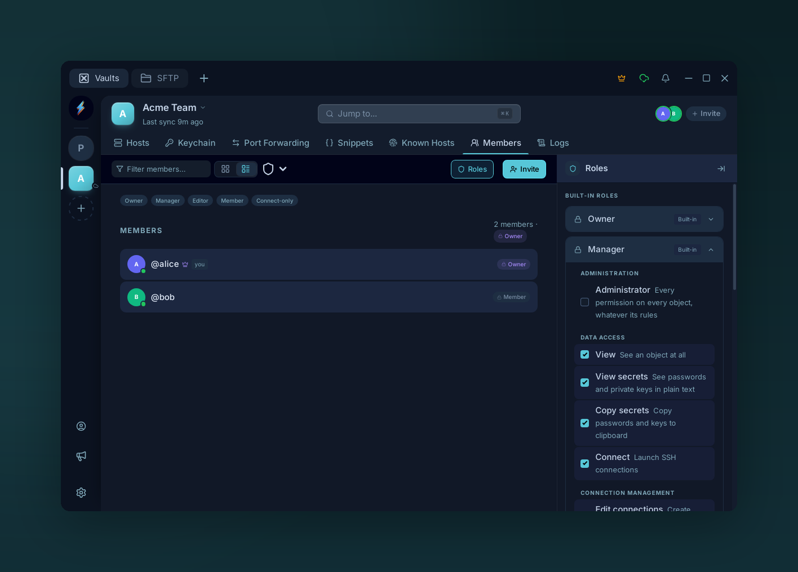
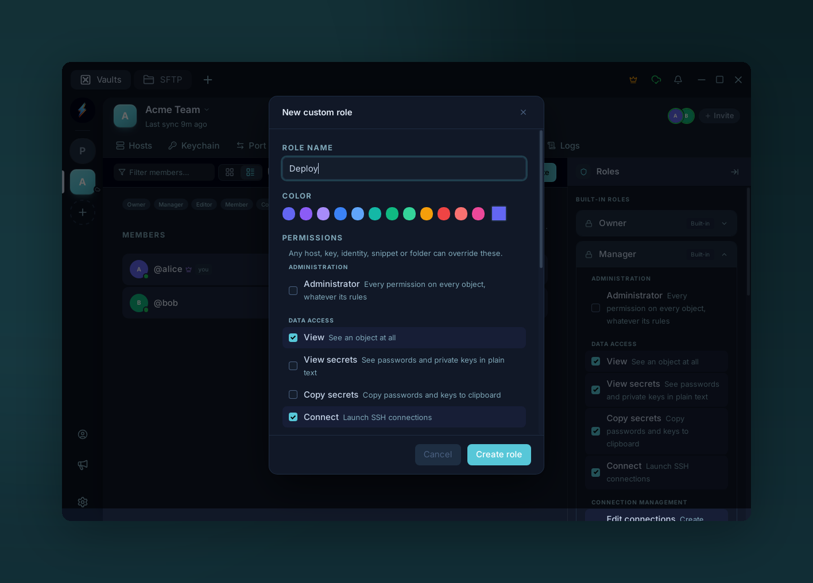
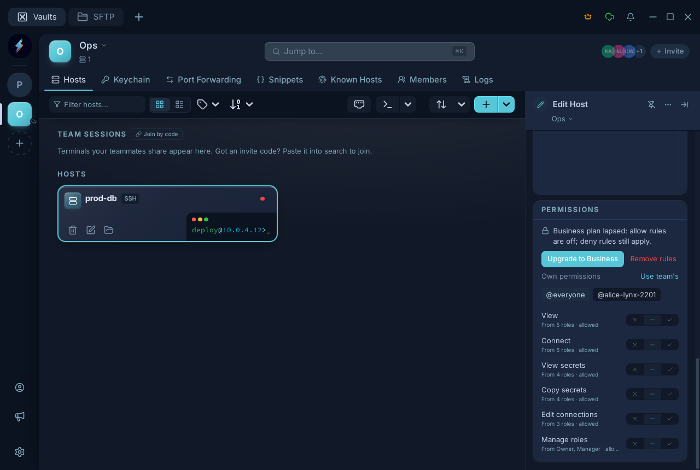

# Roles & permissions

{ .voltius-shot }
/// caption
Every member gets a role. Expand a built-in role to see exactly what it allows.
///

## Built-in roles (Teams)

| Role | What it can do |
| --- | --- |
| **Owner** | Everything, including billing and vault settings, and always sees every object. |
| **Manager** | Everything an Editor can, plus the audit log, inviting people and managing members and roles. |
| **Editor** | Add and change hosts, identities, keys, folders and snippets. |
| **Member** | Connect and see credentials, and edit snippets, but not change hosts or keys. |
| **Connect-only** | Open connections without ever seeing the credentials behind them. |

## Business: granular permissions

Business adds three layers on top of the built-in roles. Per-member and per-object permissions use the same **Allow / Inherit / Deny** control.

### Custom roles

{ .voltius-shot }
/// caption
Give a role a name and colour, then pick exactly the permissions it grants.
///

For example, a Deploy role that can view secrets and connect, but not copy secrets.

### Per-member permissions

Open a member and set Allow or Deny on any permission for that person only. A Deny always wins over what their roles grant.

### Per-object permissions

Every host, folder, snippet and port forward has a **Permissions** section (for keys and identities it's called **Who can use this key** / **Who can use this identity**); you see it if you have the Manage roles permission. Choose @everyone, a role or a member, then set Allow or Deny per permission.

- An object inside a folder is **synced** with the folder until you give it its own rules.
- Hiding a folder hides everything synced with it. An item with its own rules follows those rules instead.
- The owner and anyone with the Administrator permission always see and use every object.

## Downgrading from Business

When a team drops below Business, everything Business **granted** stops and everything it **restricted** stays — nobody ever gets more access than they had:

- Custom roles grant nothing; members keep their built-in roles. A member whose only role is custom loses access until you give them a built-in role or upgrade.
- A member's allowed overrides are off; their denied overrides still apply.
- On objects with their own rules, allow rules are off and deny rules still apply. The team owner still sees everything.

{ .voltius-shot }
/// caption
After a downgrade: allow rules are off, deny rules still apply, and the owner can upgrade or remove the rules.
///

You can remove rules (**Remove rules**, **Remove overrides**, removing a custom role from a member, or **Use team's** (or **Sync now** for an item in a folder) on an object) but not add or change them. Nothing is deleted: upgrading back to Business restores every rule. The team owner can upgrade from the same place.

Self-hosting? Update the server together with the app — an older server makes the app lock your team's permissions.
