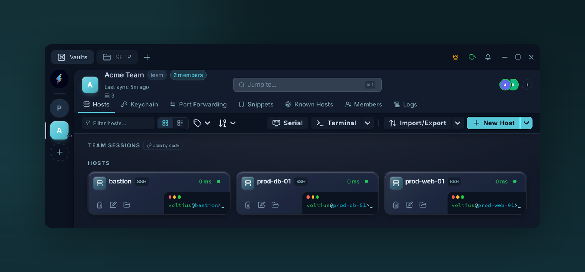

# Team vaults

{ .voltius-shot }
/// caption
A team vault sits alongside your Personal vault in the sidebar. Everything inside — hosts, keys, snippets — is shared with the team and end-to-end encrypted for every member.
///

A shared encrypted store. Each member has their own copy of the vault key, wrapped under their public key — the server only relays ciphertext.

## Creating

**Settings → Vaults → + New team vault** (Teams plan or higher).

- Pick a name (e.g. `ops`, `support`).
- The vault is created server-side and a vault key is generated locally.
- Invite members — see [Members](members.md). Their copy is wrapped under their public key at invite-time.

## What's in a team vault

Same as a personal vault — hosts, identities, keys, snippets, folders, tags — visible to every member with read access.

## Permission model

Per-vault role per member. See [Roles](roles.md).

## Leaving / removing

Removing a member revokes their copy of the vault key. Any data they already saw locally is, of course, already saw — rotate any secrets on real systems after a member leaves.

!!! warning "Rotation after offboarding"
    The vault key is unchanged on removal. For high-sensitivity vaults, follow up with **Settings → Vault → Rotate key** to re-encrypt under a fresh key. All remaining members get a re-wrapped copy automatically.
