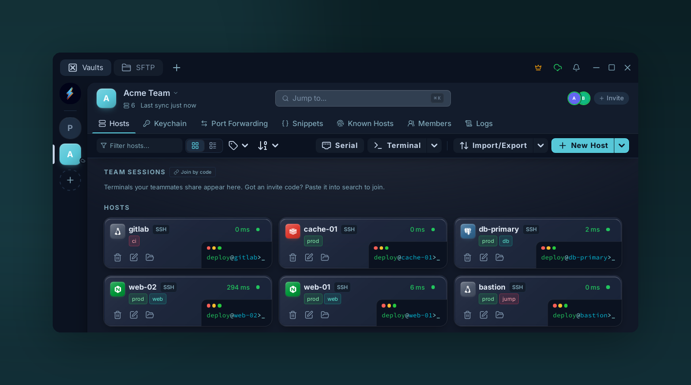

# Team vaults

{ .voltius-shot }
/// caption
A team vault sits alongside your Personal vault in the sidebar. Everything inside — hosts, keys, snippets — is shared with the team and end-to-end encrypted for every member.
///

A shared encrypted store. Each member has their own copy of the vault key, wrapped under their public key — the server only relays ciphertext.

## Creating

Click **Share** in the vault header (or pick **Share…** from its right-click menu) and choose **Turn into a team vault** (Teams plan or higher). To start from an empty vault, create one with the **+** under the vault icons in the rail first.

- Everything already in the vault moves across to the team vault.
- The vault key is generated locally; the server only stores ciphertext.
- Invite members — see [Members](members.md). Their copy is wrapped under their public key at invite-time.

## What's in a team vault

Same as a personal vault — hosts, identities, keys, snippets, folders, tags — visible to every member with read access.

## Permission model

Per-vault role per member. See [Roles](roles.md).

## Leaving / removing

Removing a member deletes their copy of the vault key and wipes the vault's contents from their devices. Voltius then rotates the vault key on its own: the next time a member who can view secrets is online, their app generates a new key, re-encrypts the vault under it and wraps a copy for every remaining member. There's nothing to click. The same rotation runs when a member loses the permission to view or copy secrets.

!!! warning "Rotate real credentials after offboarding"
    Rotation protects the vault from now on. It can't take back what the person already saw — change the passwords and keys they had access to on the real systems.
