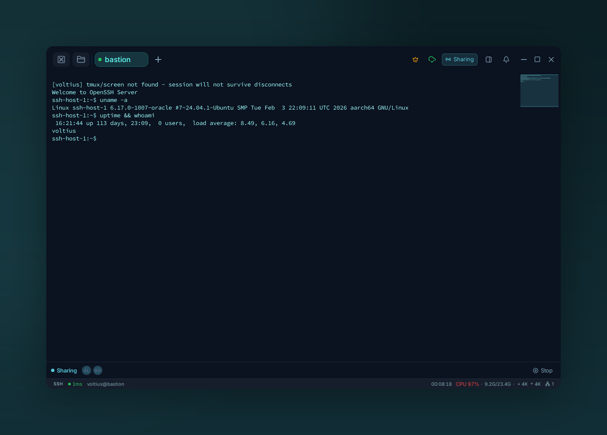

# Terminal sharing

{ .voltius-shot }
/// caption
Share a live terminal with your team. Everyone in the session shows up in the bar — you keep control until you hand it off, and can stop sharing at any time.
///

See [Terminal → Sharing](../terminal/sharing.md) for the user-side walkthrough. This page covers the **org-level controls**.

## Org policy (Business)

**Settings → Teams → Sharing.**

| Policy | What |
| --- | --- |
| **Allow sharing** | Disable entirely if needed |
| **Allow external guests** | If off, only team members can join |
| **Require approval** | An admin must approve each share request |
| **Record sessions** | Persist keystrokes + output to audit |
| **Max guests per session** | Cap |

## Audit

Every share opens an entry in the [audit log](audit-logs.md) with host, vault, joining members, and (if recording is on) the full session transcript.

!!! warning "Out-of-band auth"
    Share links are unauthenticated by themselves. Use the **Require approval** policy if you don't trust the channel guests get the link from.
