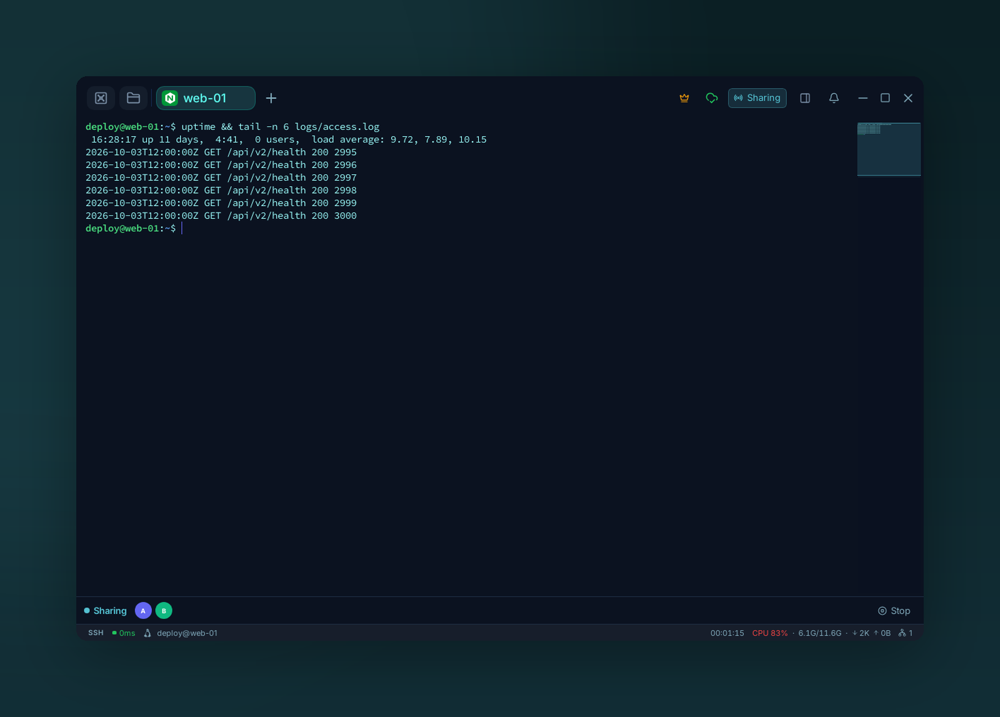

# Terminal sharing

{ .voltius-shot }
/// caption
Share a live terminal with your team. Everyone in the session shows up in the bar — you keep control until you hand it off, and can stop sharing at any time.
///

See [Terminal → Sharing](../terminal/sharing.md) for the user-side walkthrough. This page covers the **org-level controls**.

## Team controls

Sharing is governed by roles: **Start sessions**, **Join sessions** and **View sessions** are permissions like any other (custom roles and per-member overrides on Business). When you share with a team vault you can limit it to certain roles.

| Plan | Live shared sessions | Guests per session |
| --- | --- | --- |
| Pro | 1 | 1 |
| Teams | 5 | 10 |
| Business | 20 | 50 |

## Audit

Shares aren't recorded in the [audit log](audit-logs.md) yet, except shares started by an MCP agent.

!!! warning "Treat links like passwords"
    Anyone signed in to Voltius who has the link can join. Send it over a channel you trust, or invite people by name from the **People** tab instead.
