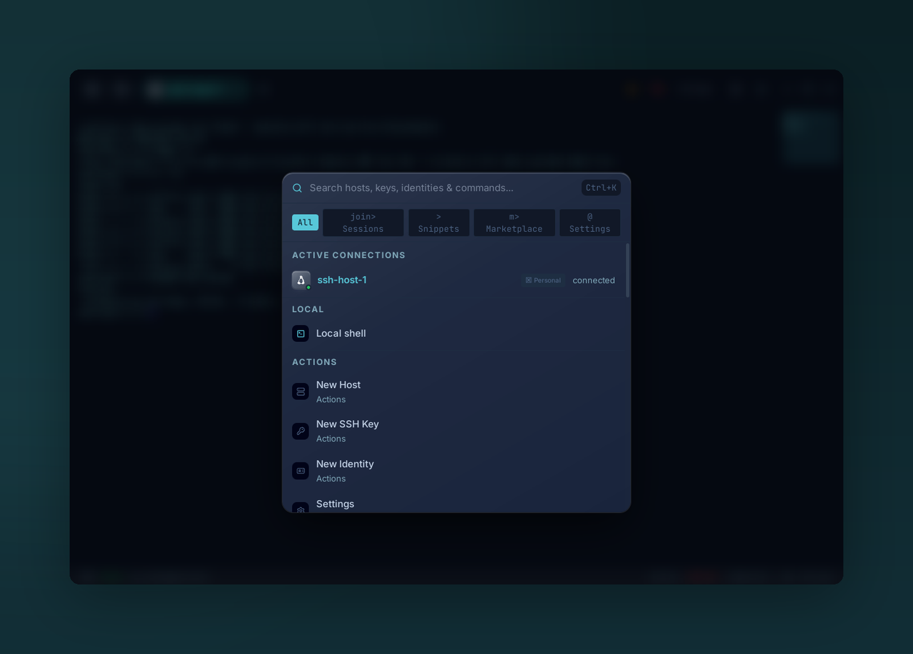

# Command palette

{ .voltius-shot }
/// caption
The command palette (Ctrl+K) — hosts, snippets, pages, and plugin actions in one fuzzy search.
///

Press ++ctrl+k++ (Windows/Linux) or ++cmd+k++ (macOS) anywhere in the app.

## What's in it

- **Hosts** — connect by name.
- **Snippets** — run a saved snippet on the active session.
- **Pages** — jump to Keychain, Port Forwarding, Settings…
- **Plugin actions** — anything plugins register via `api.omni.register`.

Sections are grouped by source. Fuzzy match runs against `label`, `keywords`, and `section`.

## Keybindings

| Key | Action |
| --- | --- |
| ++ctrl+k++ / ++cmd+k++ | Open |
| ++up++ / ++down++ | Navigate results |
| ++enter++ | Run |
| ++esc++ | Close |

Snippets and plugin actions can register their own keybinding — first registered wins on conflict.

!!! tip "Type to filter"
    Start typing to narrow. The palette ranks recent matches higher.
