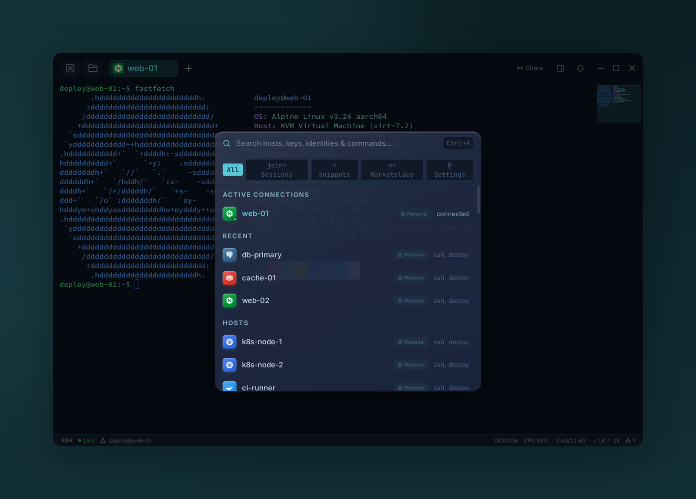

# Command palette

{ .voltius-shot }
/// caption
The command palette (Ctrl+K) — sessions, hosts, keys, snippets, pages and plugin actions in one search.
///

Press ++ctrl+k++ (Windows/Linux) or ++cmd+k++ (macOS) anywhere in the app.

## What's in it

- **Hosts** — connect by name.
- **Snippets** — run a saved snippet on the active session.
- **Pages** — jump to Port Forwarding, Known Hosts, Logs, Team Members, Settings and each settings page.
- **Plugin actions** — anything plugins register via `api.omni.register`.

Results are grouped by kind — active connections, recent hosts, hosts, keychain, snippets, actions, quick settings and settings pages. Matching is a case- and accent-insensitive substring search over a command's `label` and `keywords`.

## Keybindings

| Key | Action |
| --- | --- |
| ++ctrl+k++ / ++cmd+k++ (also ++ctrl+shift+p++, ++f1++) | Open |
| ++up++ / ++down++ | Navigate results |
| ++enter++ | Run |
| ++esc++ | Close |

Plugin actions can register their own keybinding — first registered wins on conflict.

!!! tip "Type to filter"
    Start typing to narrow. With an empty query, the palette lists your recently used hosts first.
